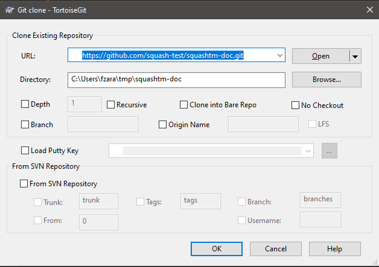
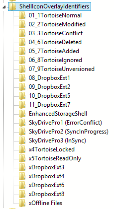
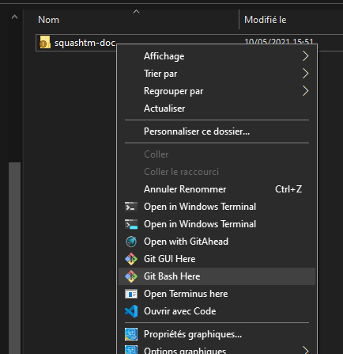

# Documentation Squash TM

Instructions spécifiques pour l'équipe d'Henix en charge de la rédaction de la documentation de Squash TM.

## Pré-requis

- Avoir accès a un compte admin sous votre Windows
- Avoir un compte sous GitHub avec droit d'écriture sur le repo de la doc

## Installation sous Windows

Commencer par installer les outils suivants

```cmd
choco install git python tortoisegit vscode
```

- Répondre  oui à tout (touche `a`)
- Redémarrer l'invite de commande en mode administrateur pour que les changements soit pris en compte
- Pour la génération de la documentation en local et en temps réel, il faut aussi installer [MkDocs](https://www.mkdocs.org) depuis une invitation de commande en mode administrateur :

```cmd
pip install mkdocs
```

## Récupérer le répertoire de travail depuis GitHub

- Clic droit dans l'explorateur de fichier à l'endroit où vous souhaitez travailler
- Sélectionner Git clone…
- Dans le champs `URL:` rentrez  `https://github.com/squash-test/squashtm-doc.git`
- Appuyez sur OK



## Configuration de Tortoise

Si jamais les petites icônes n'apparaissent pas en surimpression des dossiers, tentez de redémarrer Windows. Si cela ne fonctionne pas, il faut aller faire une petite éditions dans la bse de registre en mode administrateur.

1. via le menu démarrer, commencez à taper registre et lancez Éditeur de registre en mode administrateur

2. Allez à ou saisissez le chemin suivant : `HKEY_LOCAL_MACHINE\SOFTWARE\Microsoft\Windows\CurrentVersion\Explorer\ShellIconOverlayIdentifiers`
3. Supprimez les dossiers correspondant à des logiciels inutiles pour vous comme OneDrive ou autre. Si besoin, renommez les entrées liées à Tortoise ou supprimez les espaces en tête de répertoire des autres entrées pour que celles liées à Tortoise se retrouvent en tête.

4. Fermez l'éditeur de registre et redémarrez l'explorateur de fichier
    1. Fermez toutes les fenêtres liées à l'explorateur de fichier.
    2. Appuyez sur Ctrl+Shift+Esc pour ouvrir le gestionnaire des tâches.
    3. Cherchez "Explorateur Windows" dans la section "Processus en arrière-plan" ou Processus Windows"
    4. Clic droit dessus et sélectionnez "Redémarrer".

Pour plus de détails, voir [cet article](https://www.garethjmsaunders.co.uk/2015/03/22/managing-overlay-icons-for-dropbox-and-tortoisesvn-and-tortoisegit/).

## Bases de l'utilisation de TortoiseGit

Les commandes les plus utiles pour travailler sur la documentation sont accessibles via un clic droit dans le répertoire ou le fichier de travail.

- **Git Sync** : pour faire des **Pull** (récupérer le travail envoyé par vos collègues sur le serveur) et des **Push* pour envoyer vos commit sur le serveur à disposition de vos collègues
- **Git Add** : pour qu'un fichier, nouveau ou modifié soit pris en compte par Git
- **Git Commit** : pour ajouter des fichiers dans un commit. des fichiers commités ne sont pas automatiquement envoyé sur le serveur, il faut les synchroniser par la suite (voir *Git Sync*)
- **Git rename** : Il faut renommer ses fichiers via Tortoise et non directement dans l'explorateur de fichiers pour que ce soit correctement pris en compte
- **Git Move**  : tout comme pour renommer, il faut passer par Tortoise pour déplacer. Pour le faire, on réaliser un glisser-déposer dans la nouvelle destination via le bouton droit de la souris, puis sélectionner **Git Move versioned item(s) here**.

## Générer la documentation en local

Pour obtenir le rendu en quasi temps réel en local, il faut lancer la commande `mkdocs serve` depuis la racine du répertoire de travail qui contient le fichier `mkdocs.yml`

- Faites un clic droit sur le répertoire de travail (généralement `squashtm-doc`) et sélectionnez **Git Bash Here**

- Tapez la commande `mkdocs serve`
- Attendez la fin de la génération de la documentation (`INFO - Start detecting changes` doit apparaître dans l'invit de commande)
- allez sur votre navigateur et saisissez l'URL `https://localhost:8000`, la documentation doit s'afficher au bout de quelques secondes.

Tout modification locale sur vos fichiers est répercutée en quelques secondes dans votre navigateur !

⚠️ Ne pas fermer l'invit de commande ouverte par **Git Bash Here** ni utiliser de commande telle que [Ctrl+C] ou [Ctrl+D] sous peine de stopper le rendu en temps réel.

## Bonnes pratiques

- Comme vous travaillez tous sur la même branche en même temps, pur faciliter les synchronisations et éviter les conflits d'éditions parfois longs à gérer, ne travaillez pas en même temps sur un même fichier.
- limiter l'arborescence limitée au maximum à 3 niveaux
- garder des noms de fichier
    - courts
    - sans accents ni caractères spéciaux
    - en minuscules
    - mettre des tirets à la place des espaces
- pour tout nouveau fichier, il faut l'ajouter aussi au bon endroit dans la section `nav` du fichier `mkdocs.yaml`
