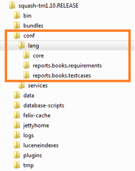

# Externalisation des fichiers de langues

Cette partie présente le fonctionnement de l’externalisation des fichiers de langues utilisés pour l’internationalisation de Squash TM et de ses différents plugins.

## Fonctionnement des fichiers de langues

Les fichiers de langues utilisés pour l’internationalisation de Squash TM, sont des fichiers avec l’extension .properties.
Il y a un fichier ‘principal’ nom_du_fichier.properties puis un fichier pour chaque langue qui est nommé nom_du_fichier_locale.properties. 

La valeur « locale » doit être remplacée par le code correspondant à la langue, par exemple en pour l’anglais ou fr pour le français.
Ces fichiers sont composés d’associations clé/valeurs pour chaque traduction à effectuer. 

_Exemple de fichier :_

    report.name = SampleReport
    report.name = ThisisaSampleReport,thatissuppliedwiththearchetypeasanexampleforyourowndevelopments.

Ces fichiers de langues sont utilisés pour que Squash TM s’affiche dans la langue sélectionnée depuis le navigateur. 
Depuis Squash TM v1.11.0.release, il est désormais possible d’externaliser la gestion des fichiers de langues. Il est donc aisément possible d’ajouter de nouvelles langues et de modifier les existantes.

## Fichiers de langues externalisés

Pour faciliter le changement de tout ou partie des fichiers de langues, il est possible de redéfinir les fichiers de langue dans le répertoire config/lang de squash-tm.

_Exemple d’arborescence :_

{class="centre"}

Ces fichiers devront être placés dans un sous répertoire ayant le nom du plugin et le nom des fichiers de langues seront dépendants du plugin. Dans le tableau ci-dessous est récapitulé le nom des répertoires et des fichiers de langues à utiliser :

| Plugin | Nom du sous-répertoire | Nom du fichier de langue |
|--|--|--|
| Redmine | plugin.bugtracker.redmine | messages |
| Bugzilla | plugin.bugtracker.bugzilla | bugzilla |
| Jira BT Server | henix-tm-jira-rest-connector | jira-rest |
| Report Qualitative coverage | squash-tm-report-qualitativecoverage | messages |
| Report requirements | reports.books.requirements | messages |
| Report testcases | reports.books.testcases | messages |
| Squash TM | plugin.bugtracker.mantis | mantis-bugmessages |
| Report std | Report std | messages |
| Report test | plugin.report.test | messages |
| Workspacewizard test | plugin.workspacewizard.test | messages |

- Ces fichiers de langues externalisés sont optionnels. En l’absence de ces fichiers, ce sont les fichiers de langues définis en interne qui seront utilisés.
- De plus il n’est pas nécessaire de redéfinir toutes les clés, si des clés sont absentes du fichier externe, ce sera la clé du fichier interne qui sera utilisé.
- Il est possible d’ajouter de nouvelles langues à squash ou à ses plugins, pour ce faire il suffit d’ajouter le fichier nom_du_fichier_locale.properties. Par exemple pour traduire squash en italien il suffit de rajouter dans le dossier conf/lang/core le fichier messages_it.properties et bien sur de traduire chaque clé en italien.

_Contacter le référent Squash de votre organisation pour obtenir la liste des fichiers de langues à modifier ou à traduire._ 

**Remarques Yamina :**

**Il manque de nombreux plugins dans cette liste. EN outre, j'ignore à quoi correspond le plugin Report std**