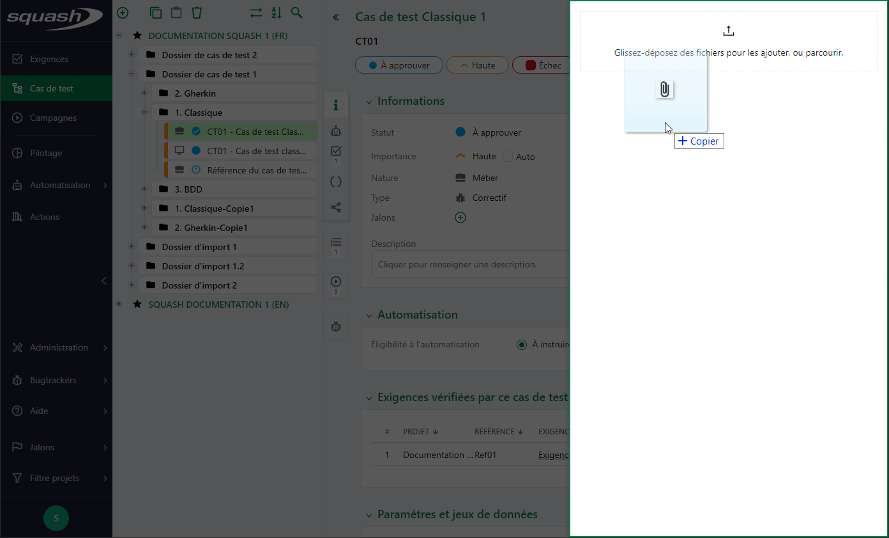

# Ajouter / Supprimer une pièce jointe

## Ajouter une pièce jointe
À partir de la sélection d'un objet d'une bibliothèque (dossier, exigences, cas de test, pas de test, campagne, itération ou suite), il est possible d'ajouter des pièces jointes via l'icone  présent sur l'ensemble des pages de consultation.
L'ajout se fait par glisser déposer dans l'encart dédié ou en parcourant les répertoires locaux.

Une fois ajoutée, le nom, la taille et la date d'ajout de la pièce jointe sont visibles sur le volet. Il est alors possible de récupérer l'url de cette pièce jointe (par simple copié) : ainsi collée dans un champ de type texte riche partout ailleurs dans l'application, la pièce jointe est téléchargeable.

!!! note "Info"
Par défaut, les types de fichier acceptés sont  txt, doc, xls, ppt, docx, xlsx, pptx, odt, ods, odp, pdf. La liste est modifiable par un Administrateur pour ajouter ou supprimer des extensions.
Par défaut, la taille maximale d'une pièce jointe est de 4000000 bytes, elle aussi peut être ajustée par un Administrateur.

## Supprimer une pièce jointe
À partir du volet des pièces jointes, la suppression des pièces jointes est possible, unitairement, via le bouton **[poubelle]** présent en bout de ligne.

