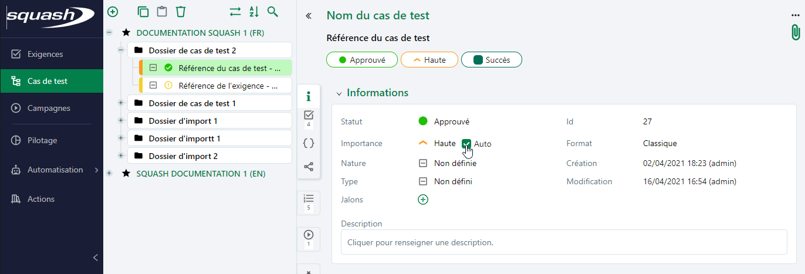
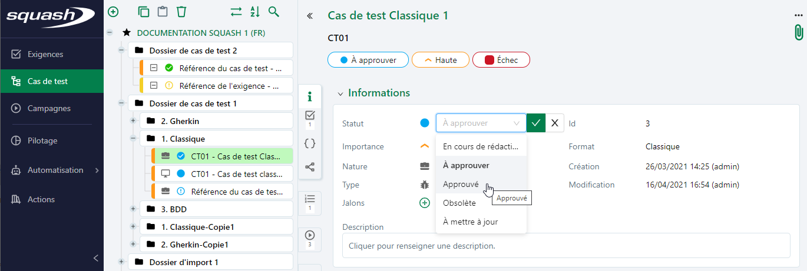
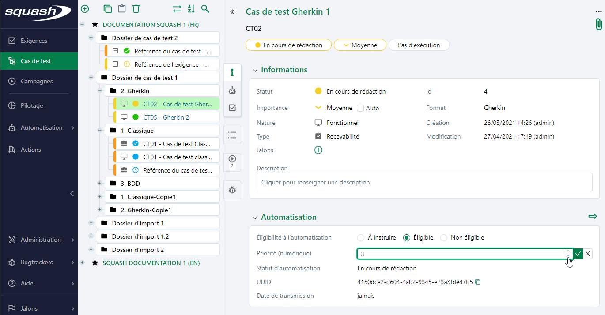

# Modifier les champs d'un objet
Chaque objet de Squash est constitué de divers attributs représentés sous forme de champs, natifs ou personnalisés, obligatoires ou facultatifs, éditables ou non et de différents types. Au survol de la valeur du champ, un icone 'Crayon' indique que le champ est modifiable.
## Modifier un champ de type Texte simple
Les noms et références des objets sont de type Texte simple.
Au clic sur la valeur du champ, il devient éditable : tous les caractères sont autorisés. La touche **[Entrée]** du clavier ou le bouton **[V]** enregistre la saisie.
  

  
## Modifier un champ de type Case à cocher
L'importance d'un cas de test dispose d'une case à cocher 'Auto' (cela permet d'attribuer, par correspondance automatique, une importance à un cas de test en fonction de la priorité de son exigence liée).
Un simple clic dans la case du champ permet de cocher ou décocher la case.
  

  
## Modifier un champ de type Date
Les campagnes et itérations disposent de champs de type Date (bloc **Plannings**).
Le clic sur le champ le rend éditable : il est possible de saisir manuellement une date au format jj/mm/aaaa ou de sélectionner une date directement dans le calendrier.
  

  
## Modifier un champ de type Liste déroulante
Le statut, la criticité ou la catégorie d'une exigence, le statut, l'importance, la nature ou le type d'un cas de test et l'état d'une campagne ou d'une itération sont des champs de type Liste déroulante.
Au clic sur le champ, les options de liste s'affichent. Au clic sur l'une d'elle, la valeur s'inscrit dans le champ. La touche **[Entrée]** du clavier ou le bouton **[V]** enregistre la sélection.
  

  
## Modifier un champ de type Numérique
Le champ priorité d'un cas de test éligible à l'automatisation est un champ de type numérique.
Le clic sur le champ le rend éditable : seul un nombre entier est saisissable. La touche **[Entrée]** du clavier ou le bouton **[V]** enregistre la saisie.
  

  
## Modifier un champ de type Tag
Au clic sur une champ de type Tag, il est possible de saisir des valeurs libres.  La touche **[Entrée]** du clavier ou le bouton ajoute une nouvelle étiquette au champ. Chacune d'elle dispose d'une croix permettant de la supprimer individuellement.
  

  
## Modifier un champ de type Texte riche

Le champ Description de tous les objets est de type Texte riche.
Il est possible de mettre en forme un texte, d'insérer un lien, un tableau ou une image.
Le bouton agrandir permet quant à lui d’ouvrir en mode plein écran les champs de type Texte enrichi et de repasser en mode réduit.
  

  
!!! warning "Focus"
	D'une manière générale, nous ne recommandons pas l'ajout d'image directement dans un champ Texte riche : elles alourdissent considérablement les divers exports possibles via tableur voire empêchent leur génération. Pour connaître la marche à suivre pour ajouter une image dans un champ texte riche, consulter le module [Les champs texte riche](**../../1.4.12.champs-texte-riche.md). 

# Modifier les attributs d'un objet
Chaque objet de Squash est constitué de divers attributs représentés sous forme de champs de différents types. Au survol de la valeur du champ, un indicateur visuel signale à l'utilisateur qu'elle est modifiable (valeur soulignée, icône crayon ou cadre de couleur).

Pour modifier un attribut, il suffit de cliquer sur la valeur du champ, de renseigner une nouvelle valeur, puis de valider (bouton **[Confirmer]** ou touche **[Entrée]** du clavier).

Les différents types de champs présents dans l'application sont les suivants :

- Texte simple : texte sans mise en forme, sur une seule ligne
- Case à cocher
- Date : permet de sélectionner une date dans un calendrier ou de la saisir au format jj/mm/aaaa
- Liste déroulante
- Numérique
- Tag : permet de saisir une ou plusieurs valeurs sous forme d'étiquettes avec de l'autocomplétion
- Texte riche : texte multilignes avec de la mise en forme

!!! info "En savoir plus"
	Pour plus de détails sur les champs texte riche, consulter la page "*Les champs texte riche*"

<!--stackedit_data:
eyJoaXN0b3J5IjpbNTM5MzM1MTZdfQ==
-->
