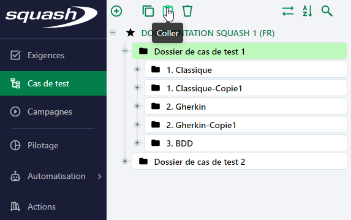

# Copier/coller un objet

## Bouton [Copier la sélection] 

Lors d'une sélection simple, multiple continue ou discontinue, le bouton  est actif. Lorsque la sélection comporte un élément ne pouvant être copié, le bouton est grisé (un projet par exemple).
Il est également possible de copier une sélection en utilisant le raccourci  clavier **Crtl+C**.

## Bouton [Coller]

Lorsque des éléments ont été copiés, il faut sélectionner un répertoire de destination pour activer le bouton  :

- la copie d'éléments peut se faire au sein d'un même projet ou dans un autre projet
- si les deux projets présentent la même configuration les attributs des éléments sont repris à l'identique
- si les deux projets présentent des configurations différentes, les valeurs par défaut des champs ou listes personnalisées du projet de destination seront attribués aux éléments collés
- les éléments copiés sont gardés en mémoire et peuvent être collés à différents emplacements dans l'arborescence
- lorsque la sélection comporte un élément ne pouvant être copié dans l'élément cible, le bouton est grisé : un dossier ne peut pas être copié dans une exigence, un cas de test dans un autre cas de test ou une itération dans un projet

Il est également possible de coller une sélection en utilisant le raccourci  clavier **Crtl+V**.

!!! warning "Focus"
	Lors du copier/coller d'un objet de l'espace Campagnes, les exécutions des tests présentes dans les plans d'exécution ne sont pas conservées.
