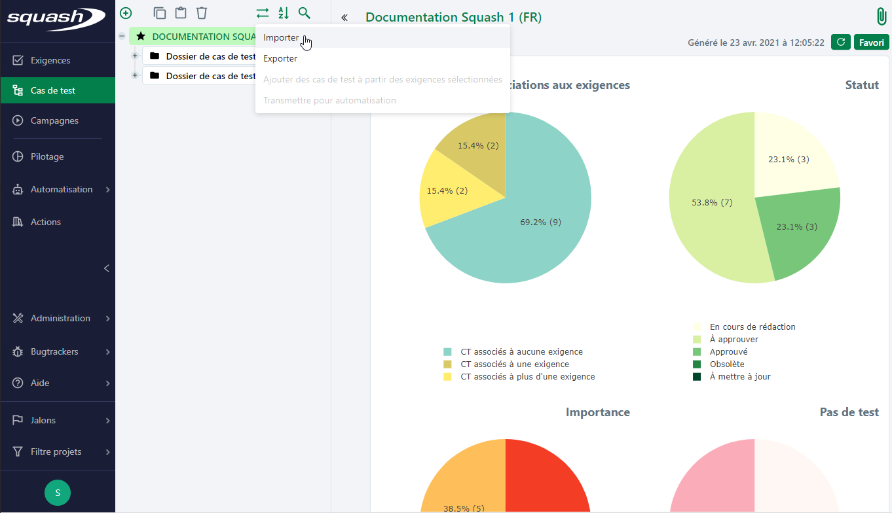
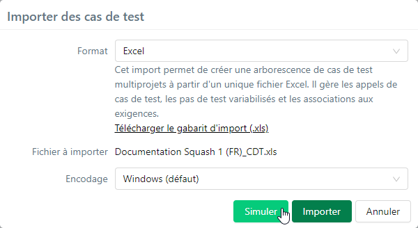

# Importer/Exporter un objet

## Bouton [Importer/Exporter]

Depuis les espaces Exigences, Cas de test et Campagnes, le bouton [Importer/Exporter](resources/icone-import-export.png) affiche un sous-menu permettant d'accéder aux fonctionnalités d'import/export.

### Importer

La fonction d'import permet d'importer en masse une arborescence d'éléments dans les espaces Exigences ou Cas de test. Il est notamment possible d'importer depuis un même fichier des éléments dans différents projets Squash.

Pour importer une arborescence d'exigences ou de cas de test au format Excel :

1. Cliquer sur l'option 'Importer'
2. Dans la popup d'import, télécharger le gabarit d'import
3. Compléter le fichier d'import
4. Choisir le fichier d'import depuis la popup
5. Simuler l'import. Cette étape permet de vérifier que le fichier d'import est conforme, elle est facultative.
6. Importer le fichier 
7. Une fois l'import effectué, l'arborescence est mise à jour.

À l'issue de la simulation et/ou de l'import, un rapport s'affiche et présente :

- les lignes traitées avec succès : aucune erreur rencontrée, les objets sont importés tels qu'ils figurent dans le fichier
- les lignes traitées avec réserve : les objets sont importés mais des éléments peuvent manquer ou avoir été modifiés
- les lignes en échec : les objets ne sont pas importés pour cause de saisie incomplète ou erronée dans le fichier d'import
- un bilan téléchargeable qui détaille les erreurs rencontrées

Il est également possible d'importer les cas de test au format Zip :

- La même procédure que pour le format Excel s'applique
- Pour ce format, il est nécessaire de sélectionner un projet de destination

!!! info "En savoir plus"
    Pour compléter un fichier d'import, consulter les pages [Renseigner un fichier d'import d'exigences](../../02.gestion-exigences/2.6.creer-modifier-en-masse-exigences-import-export/2.6.1.renseigner-fichier-import-exigences.md) et "[Renseigner un fichier d'import de cas de test](../../03.gestion-cas-test/3.7.creer-modifier-masse-cas-test-import-export/3.7.1.renseigner-fichier-import-cas-test.md)
    

!!! warning "Attention"
    L'import de campagnes, itérations ou suites n'est pas disponible.

### Exporter

La fonction d'export permet d'exporter en masse des éléments des espaces Exigences, Cas de test. Elle fonctionne sur une sélection simple, multiple continue ou discontinue d'éléments d'un ou plusieurs projets.

Pour exporter une arborescence d'exigences ou de cas de test au format Excel :

1. Sélectionner des éléments dans l'arborescence (projets, dossiers, ou objets)
2. Cliquer sur l'option 'Exporter'
3. Dans la popup, choisir le format d'export. Le format XLS est compatible au format attendu pour un import  tandis que le format CSV est idéal pour l'exploitation de données.
4. Nommer le fichier d'export
5. Choisir les options d'export. L'option 'Conserver le format des textes riches' permet de conserver les balises html des champs texte riche (ex: champ 'Description') afin de conserver leur mise en forme pour un futur import
6. Cliquer sur [Exporter] pour télécharger le document.

L'export dans l'espace Campagnes est différent. Il ne fonctionne que si une seule campagne est sélectionnée et il se décline sous trois formes :  simple, standard ou complet.

!!! info "En savoir plus"
    Pour plus de détails sur les exports de campagnes, consulter la page *"Exporter une campagne depuis la bibliothèque"*

Pour exporter une campagnes au format Excel :

1. Sélectionner une campagne
2. Survoler le bouton 
3. Choisir un des 3 formats d'export possibles.
4. Le fichier est téléchargé directement au format CSV sur le poste de l'utilisateur.

<!--stackedit_data:
eyJoaXN0b3J5IjpbLTEzMTA1Mjk5NDUsLTI5MzU1Mjg5Nyw0ND
E4NDcwODYsNDU2MTQ3NzgyLC02ODI2NTQ2NzIsLTEyMzQ1NTA4
ODksLTE4MjcxMDAzMDksLTEzNzE2NTQyNzVdfQ==
-->
