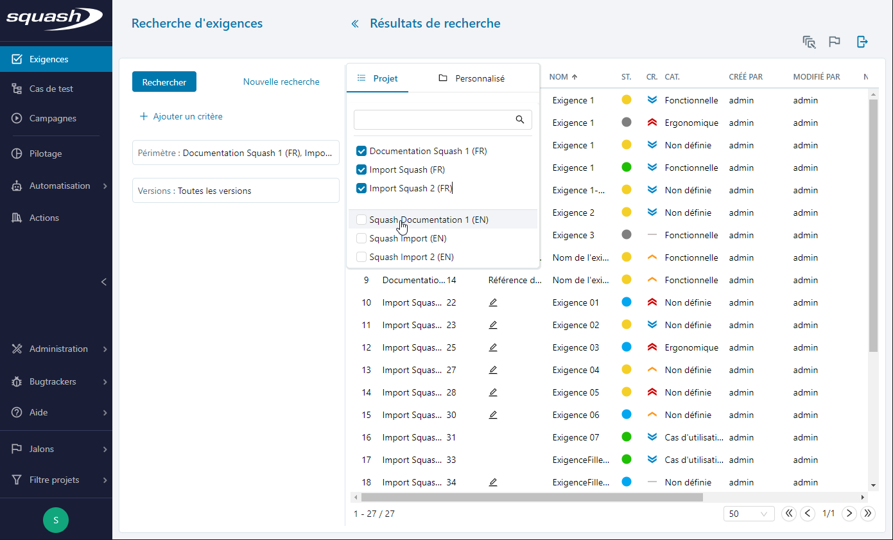
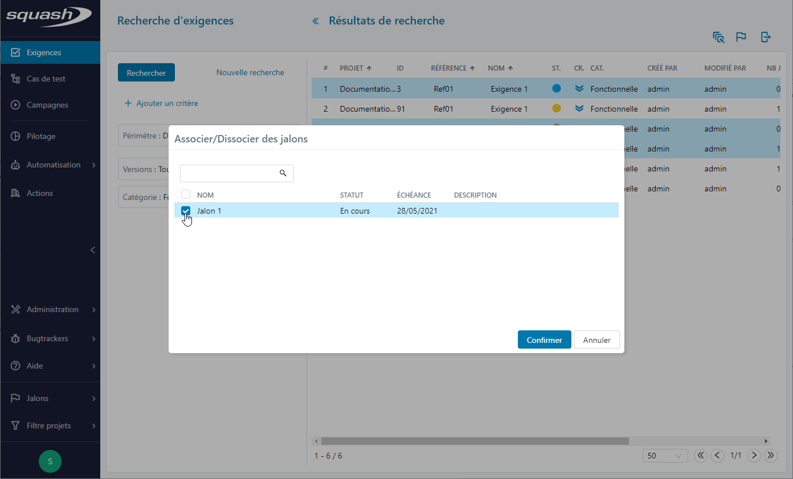

# Rechercher un objet
## Bouton [Rechercher] 
Au clic sur ce bouton présent au dessus des bibliothèques Exigences, Cas de test et Campagnes, la page de recherche propre à chaque espace s'ouvre. Par défaut, le périmètre de recherche est celui du filtre projet.
Le volet sur la gauche de la page des résultats de recherche permet de définir un périmètre de recherche et d'ajouter des critères de recherches propres aux objets de l'espace.

### Le périmètre
Depuis le critère Périmètre et l'onglet Projet, il est possible de sélectionner ou désélectionner par case à cocher le ou les projets à inclure ou exclure du périmètre.

L'onglet Personnalisé permet de sélectionner un ou plusieurs répertoires ou des éléments pour définir le périmètre de recherche.

### Les critères
L'ajout de critères de recherche se fait par simple sélection des attributs disponibles pour l'entité de l'espace à partir du bouton **[Ajouter des critères]**. La liste de résultat se met automatiquement à jour à la sélection d'un critère.

 

Le clic sur le bouton **[Nouvelle recherche]** réinitialise les critères de recherche.

### Modifier les attributs
À partir d'une sélection simple ou multiple dans la table de résultats, il est possible de modifier en masse certains attributs :

 - le statut, la criticité ou la catégorie de la version d'une exigence
 - l'importance, le statut, le type, la nature ou l'éligibilité à l'automatisation d'un cas de test
 - le statut d'exécution d'un test associé à un plan d'itération
 
 

!!! note "Info"
	Il est possible via cette fonctionnalité d'appliquer le statut Approuvée à une version d'exigence depuis n'importe quel autre statut.

### Modifier les associations aux jalons
À partir d'une sélection simple ou multiple dans la table de résultats, il est possible d'associer en masse la sélection à un jalon à condition que le jalon soit déjà associé au projet auxquels appartiennent les objets sélectionnés.

### Exporter
À partir du bouton **[Exporter]**, il est possible d'exporter vers un tableur tout ou sélection du résultat de recherche.
Diverses options sont alors disponibles : 

 - le format XLS 'Champs actuels' : cet export permet de récupérer les données des exigence ou des cas de test sous la forme d'un classeur Excel n'ayant que les informations affichées dans les résultats de recherche;
 - le format XLS 'Tous les champs' : cet export permet de récupérer l'intégralité des données des exigences des cas de test sous la forme d'un classeur Excel.
 - conserver le format des textes riches : les champs de type "texte riche" seront exportés avec leur balises HTML afin de conserver la mise en forme lors d'un futur import. Ne pas conserver le format facilite la lecture de ces champs dans l'export
 - inclure ou non les cas de test appelés (pour l'espace Cas de test uniquement)

!!! note "Infos & En savoir plus"
	Les résultats de recherche de l'espace Campagne ne sont pas exportables mais il est possible d'[ajouter tout ou sélection des résultats à un plan d'exécution d'une itération](/[04.gestion-executions](https://github.com/squash-test/squashtm-doc/tree/main/docs/user-guide/04.gestion-executions/4.2.planifier-campagnes-tests/4.2.4.identifier-tests-resultats-exec-precedents-plugin.md**).
  
<!--stackedit_data:
eyJoaXN0b3J5IjpbNDIwNzMzNjgwXX0=
-->
((https://github.com/squash-test/squashtm-doc/tree/main/docs/user-guide/04.gestion-executions)/[4.2.planifier-campagnes-tests](https://github.com/squash-test/squashtm-doc/tree/main/docs/user-guide/04.gestion-executions/4.2.planifier-campagnes-tests)/**4.2.4.identifier-tests-resultats-exec-precedents-plugin.md**)

[texte](**../../../../04.gestion-executions/4.2.planifier-campagnes-tests/4.2.4.identifier-tests-resultats-exec-precedents-plugin.md)
