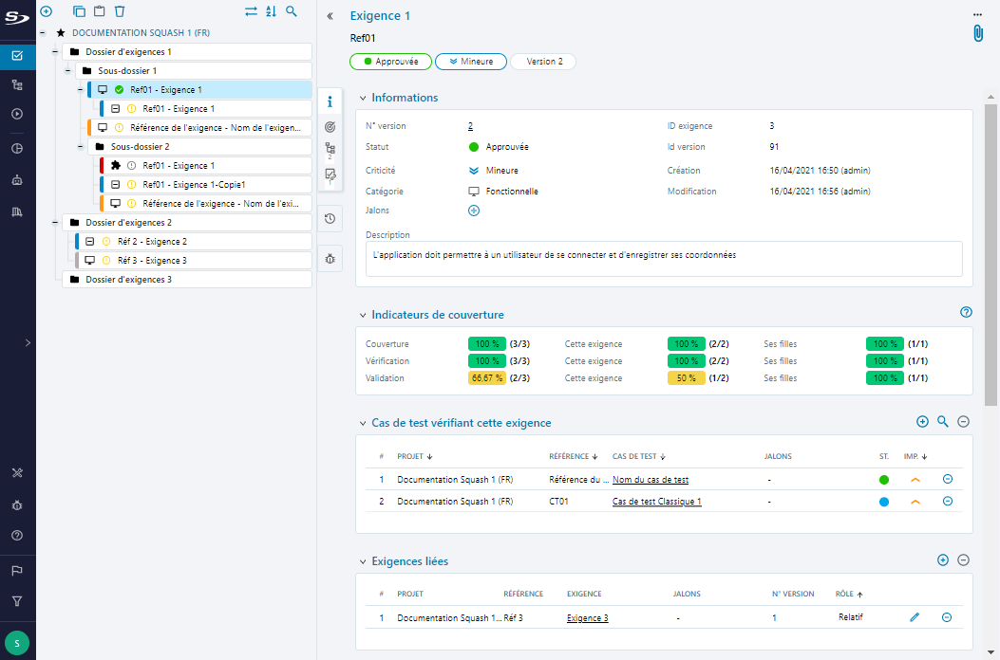

# La page de consultation d'une exigence

La page de consultation d'une exigence s'affiche lorsque l'exigence est sélectionnée dans la bibliothèque des exigences.

La page de consultation de l'exigence est constituée :

- du nom et de la référence
- de capsules indiquant le statut, la criticité et le numéro de version de l'exigence
- des attributs de l'exigence et de ses associations dans des blocs dédiés rétractables

!!! info "Info"
	Le nom et la référence (facultative) sont déterminés lors de la création de l’exigence. Avoir une exigence avec une référence est fortement conseillé afin d'organiser son référentiel. Il est possible de modifier la référence et le nom depuis la page de consultation d'une exigence. 

L'ajout d'une nouvelle version de l'exigence ou d'une pièce jointe est possible via les boutons situés en haut à droite de la page : [Icone_attachement_FR-EN] et [Icone_more_FR-EN].

La barre des ancres à gauche, permet au clic sur une ancre, d'accéder au bloc correspondant :

###  Informations

Le bloc 'Informations' affiche notamment les attributs de l'exigence : 'Statut', 'Criticité', 'Catégorie' et 'Description' ainsi que ses champs personnalisés.

### Indicateurs de couverture

[Icone_coverage_indicators_FR-EN] 
Le bloc 'Indicateur de couverture' présente les indicateurs suivants  (voir Suivi de la couverture et des exécutions [Lien cliquable]):

- 'Taux de couverture' : indique le pourcentage de cas de test au statut 'A approuver' ou 'Approuvé', parmi tous les cas de test couvrant l'exigence ou l'une de ses descendantes.
- 'Taux de vérification' : indique le pourcentage de cas de test exécutés, en ne tenant compte que de la dernière exécution, parmi les cas de couvrant l'exigence ou l'une de ses descendantes
- 'Taux de validation' : indique le pourcentage de cas de test ayant un statut d'exécution concluant (Succès ou Arbitré), en ne tenant compte que la dernière exécution, parmi les cas de test exécutés couvrants l'exigence ou l'une de ses descendantes. 

### Cas de test vérifiant cette exigence

[Icone_linked_test_cases_FR_EN] 
Le bloc 'Cas de test vérifiant cette exigence' permet d'associer des cas de test à l'exigence. Une table affiche les informations des cas de test associés.

### Exigences liées

[Icone_linked_requirements_FR-EN] 
Le bloc 'Exigences liées' permet d'associer des exigences à l'exigence consultée. Une table affiche les informations des exigences liées.

### Historique des modifications

[Icone_history_FR-EN] 
La table 'Historique des modifications' liste toutes les modifications apportées à une exigence dès lors que son statut passe de 'En cours de rédaction' à 'A approuver'.

### Anomalies connues

[Icone_issues_FR-EN] 
La table 'Anomalies connues'* liste les anomalies déclarées lors de l’exécution des tests liés à l'exigence. La table est alimentée automatiquement et en temps réel par le bugtracker et ne peut être modifiée.
Trois liens cliquables permettent à l'utilisateur d'accéder à :

- la page de consultation de l’anomalie dans le bugtracker
- la page de consultation de l’exécution durant laquelle l’anomalie a été relevée
- la page de consultation de l’exigence

Dans le cas où il existe plusieurs versions de l’exigence, seules les anomalies associées à la version courante de l’exigence sont affichées.
Dans le cas où il existe une hiérarchie d’exigences, la table 'Anomalies connues' de l’exigence mère liste à la fois toutes les anomalies associées  à l’exigence mère et à ses descendantes.

---
\* Cette ancre s'affiche uniquement lorsqu'un bugtracker est associé au projet de l'exigence

<!--stackedit_data:
eyJoaXN0b3J5IjpbLTIxNDIzMjk3MDksMTU3MDEyNjUzMCwtMT
AxMTcyNTAxMSwzMjg2MjcyNCwtMTE2NTUyMTg0NSw4NzIwMzkx
MDgsMTA0ODQ0OTUzOSwtMTUyODY4NjYsMTc1OTA4OTEyMiwtMT
Q4MDMyNDQwMCwyMDM3NzA3MjM1LC00MTg5MTg0NjgsLTEzNzk0
MjY2NDUsLTEzMzc1NjI5MTAsLTE5NDM1MDM1ODIsLTE2NDM1OT
M1MjEsLTEzMDYzNjIyMTksLTE5NzkzNDk3NjAsOTM2NzkzNTIz
LC0xNTA4MzQ4OTQwXX0=
-->