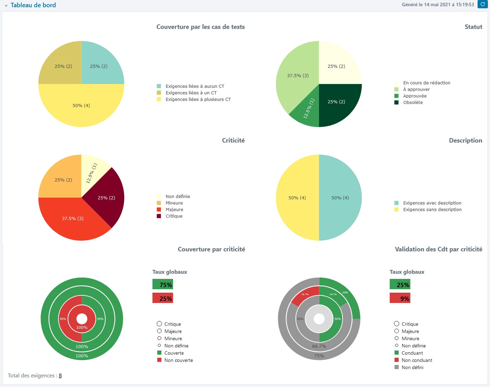

# Tableau de bord des exigences

En sélectionnant des éléments dans la bibliothèque des exigences, un tableau de bord s'affiche dans la partie droite. Il est possible d’afficher un tableau de bord par défaut ou un tableau de bord personnalisé.

Le bouton **[Rafraîchir]** en haut à droite permet de rafraîchir les graphiques du tableau de bord.
 Le bouton **[Favori]** en haut à droite permet d’afficher un tableau de bord favori personnalisé à la place du tableau de bord par défaut

!!! tip "En savoir plus"
    Pour plus de renseignements sur le tableau de bord personnalisé, consulter la page "[Les tableaux de bord personnalisés]( 7.5. Les tableaux de bord personnalisés)"

## Les différents graphiques

Le tableau de bord se divise en 6 graphiques :

- **Graphique 'Couverture par les cas de test'**

Répartition des exigences en fonction de leur association à aucun, un ou plusieurs cas de test. Ce graphique est très utile pour vérifier la couverture fonctionnelle de l'application. 

- **Graphique 'Statut'**

Répartition des exigences en fonction de leur statut de rédaction. Ce graphique permet d'avoir une vue d'ensemble de l'avancement de la rédaction des exigences.

- **Graphique 'Criticité'** 

Répartition des exigences en fonction de leur criticité. 

- **Graphique 'Description'** 

Répartition des exigences en fonction de la présence ou non d'une description. Ce graphique permet de visualiser rapidement si certaines exigences n'ont pas de description, et donc de pouvoir compléter cette information. Pour rappel, la description d'une exigence correspond à une spécificité de l'application, et est primordiale pour la rédaction des tests.

- **Graphique 'Couverture par criticité'**

Répartition des exigences en fonction de leur criticité et du taux de couverture des exigences par des cas de test.

- **Graphique 'Validation des Cdt par criticité'**

Répartition des exigences en fonction de leur criticité et du taux de validation des cas de test associés aux exigences. Ce graphique permet, par exemple, de savoir si toutes les exigences critiques associés à un cas de test, ont été exécutés en succès.

## Accès à la page de recherche

Au clic sur les portions d'un graphique du tableau de bord par défaut, une page de recherche s'affiche, avec les critères présélectionnés correspondant à la portion de graphique.

**Par exemple:**
 
  Au clic sur la portion de graphique "Exigences liées à aucun CT" du graphique "Couverture par les cas de test", une page de recherche s'affiche avec le critère "Nombre de cas de test : Egal 0". 
  En cliquant sur le bouton  ou le bouton  il est possible de modifier directement le cas de test, et d'associer au moins un cas de test pour chaque exigence.
