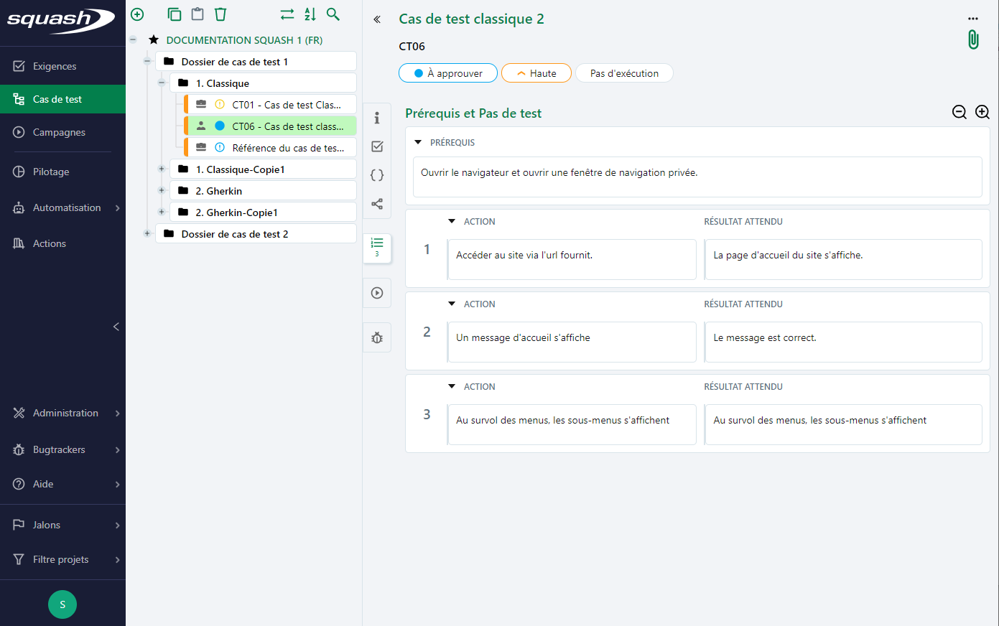

# La page de consultation d’un cas de test

La page de consultation d'un cas de test s'affiche lorsqu'un cas de test est sélectionné dans la bibliothèque des cas de test.

La page de consultation d'un cas de test est constituée:

- du nom et de la référence
- de capsules indiquant le statut, l'importance et le statut de la dernière exécution
- des blocs spécifiques indiquant la ou les exigence(s) vérifiée(s), les éventuels paramètres et jeux de données et le(s) cas de test appelé(s)

!!! note "Info"
	Le nom et la référence (facultative) sont déterminés lors de la création du cas de test. Avoir un cas de test avec une référence est fortement conseillé afin d'organiser son référentiel. Il est possible de modifier la référence et le nom depuis la page de consultation du cas de test.

Il est possible d'exporter le cas de test via le bouton  puis [Exporter] ou d'y ajouter une pièce jointe via le bouton  en haut à droite de la page. 

La barre des ancres à gauche, permet au clic sur une ancre, d'accéder au bloc correspondant :
####  Informations
Le bloc 'Informations' affiche les attributs du cas de test: 'Statut', 'Importance', 'Type', 'Nature', et 'Format', sa description ainsi que ses champs personnalisés.

####  Exigences vérifiées par le cas de test
Le bloc 'Exigences vérifiées par le cas de test' permet de relier la ou les exigence(s) couverte(s) par le cas de test. Une table affiche les informations des exigences associées.

####  Paramètres et jeux de données
Le bloc 'Paramètres et jeux de données' permet de variabiliser et de valoriser des pas de test par une gestion des paramètres et des jeux de données.
Au lieu de renseigner une valeur dans le bloc "Action" ou dans le bloc "Résultat attendu", il est possible de renseigner un paramètre qui pourra prendre une ou plusieurs valeurs (jeux de données). Les paramètres renseignés dans les pas de test sont automatiquement reportés dans la table des 'Paramètres et jeux de données'.

####  Cas de test appelé par 
Le bloc 'Cas de test appelé par' liste les tests qui appellent le cas de test en cours. Le mécanisme d'appels de tests dans un cas de test permet la construction de bibliothèques modulaires de cas de test. Lors de l'exécution, les pas de test du cas de test appelé sont vu comme des pas de test dans le cas de test appelant. Une table affiche les informations des cas de test "appelant".

!!! note "Info"
	Ce mécanisme peut également être utilisé pour des tests de bout en bout faisant appel au patrimoine de tests de différents projets.

####  Prérequis et pas de test
Le bloc 'Prérequis et pas de test' est constitué de deux parties:
- Prérequis: qui recueille les préconditions du cas de test 
- Pas de test: qui se compose d'une suite d'actions à accomplir et des résultats attendus correspondants.

####  Exécutions
Le bloc 'Exécutions' liste les exécutions du cas de test et leurs attributs (statut, identifiant du testeur ayant exécuté le cas de test, date de l'éxecution et nombre d'anomalies remontées). La table est alimentée automatiquement, en temps réel et ne peut être modifiée. 

####  Anomalies connues
La table 'Anomalies connues'* liste les anomalies déclarées lors de l’exécution des cas de test. La table est alimentée automatiquement et en temps réel par le bugtracker et ne peut être modifiée.
Trois liens cliquables permettent à l'utilisateur d'accéder à :
 - la page de consultation de l’anomalie dans le bugtracker
 - la page de consultation de l’exécution durant laquelle l’anomalie a été relevée
 -  la page de consultation de l’exigence

---
*Cette ancre s'affiche uniquement lorsqu'un bugtracker est associé au projet de l'exigence.
structure/capsule/ancres d’un CT
<!--stackedit_data:
eyJoaXN0b3J5IjpbMTcyMjAzNzM4MSwxMDk2MDQ1NjgwLDgyNz
E5MjM1MywtMTM0NTg3NjQ4MiwtMjY2NjIxNTUyLDE2MDk5Mzkz
MzIsMjA0MjQ5NTQ0Niw5MzAzNTEzODYsMTc0MzY1MjU3MiwxMz
A1NjczMDEzLDk0MDM1NDQ2NiwtMjA5NzQ0NjY3NiwtMTM3ODA5
NjcxLC0zNDQ2NDM1MTcsLTE2MDU3NTUyMTUsODE5MzI4NDYxLD
Q1MDE0NDY5MSwxMTcwMTg0ODUsMTg2NTc1MzcxMSwtMTczNDQx
Mzc2MF19
-->