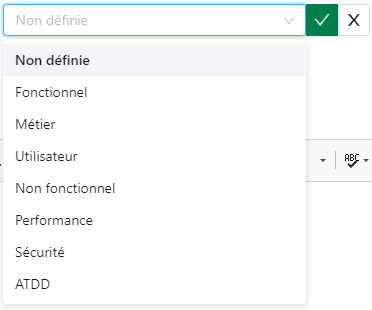

# Les attributs d’un cas de test

Un cas de test est caractérisé par différents attributs accessibles depuis le bloc 'Informations':

!!! note "Info"!!! 
	Il est recommandé de remplir les attributs de manière homogène sur l'ensemble des projets afin d'identifier plus facilement les tests à inclure aux plans d'exécution et d'optimiser la priorisation des exécutions.  
	
## Référence

La référence du cas de test est facultative, néanmoins elle permet d'organiser son référentiel. Des conventions de nommages doivent être définies pour organiser et identifier les cas de test.

## Statut

Le champ 'Statut' permet d'affecter un statut au cas de test. Par défaut, il sera "En cours de rédaction’". Chaque statut est représenté par une couleur facilement identifiable dans la bibliothèque des cas de test grâce à la pastille qui précède la référence ou le libellé du cas de test.
Le statut peut être modifiée à l'aide de la liste déroulante dont les valeurs sont les suivantes :

- 

- 

- 

- 

- 

!!! info "Info"
	Une fois validée, le cas de test peut être passé au statut 'Approuvé'. Il est alors prêt à être intégré dans une campagne et une itération pour exécution.
	Un cas de test peut être passé au statut 'Obsolète' lorsqu'il n'est pas utile pour le référentiel mais qu'on ne souhaite pas le supprimer.

## Importance

Le champ 'Importance' permet d'affecter un niveau d'importance au cas de test ('Faible' par défaut). La valeur peut être modifiée à l'aide de la liste déroulante dont les options sont les suivantes:

- 

- 

- 

- 

!!! warning "Focus" 
	La case "Auto" au niveau de l'importance permet de déterminer automatiquement l'importance du cas de test à partir de la criticité des exigences qu'il vérifie.

!!! info "Info"
	L'importance du cas de test peut être utilisé pour organiser et prioriser les exécutions mais aussi pour en analyser les résultats (taux de succès/échec en fonction de l'importance des tests, importance des tests jamais exécutés).

## Nature

La valeur du champ 'Nature' est 'Non définie' par défaut. Elle peut être modifiée à l'aide de la liste déroulante.
 
Le champ nature peut être utilisé pour classer et organiser le patrimoine de test. 

## Type

La valeur du champ 'Type' est 'Non définie' par défaut. Elle peut être modifiée à l'aide de la liste déroulante. 

Le champ type peut être utilisé pour classer et organiser le patrimoine de tests mais aussi pour identifier facilement un certain type de cas de test à ajouter à une campagne (exemple: les tests de non-régression)

## Description

Le bloc 'Description' permet de décrire l'objectif du cas de test. La description reprend souvent les éléments de l'exigence associée au cas de test.
La description peut débuter par "*Le cas de test vérifie que [action]*".

## Champs personnalisés

Il est possible d'ajouter des champs personnalisés dans le bloc 'Informations' du cas de test. On parle de CUF (CUstom Field). Pour plus d'informations sur les CUF, se référer à la section : ==>> lien.

Ces champs personnalisés peuvent prendre plusieurs formes (texte, case à cocher, date, tag...) et peuvent être ajouté au niveau d'un dossier de cas de test, d'un cas de test ou d'un pas de test.
