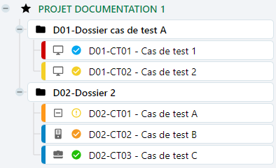

# Organiser le référentiel de tests

Squash TM offre plusieurs moyens visuels et méthodologiques permettant d'organiser le référentiel et d'identifier facilement les tests et leurs attributs. 

## Les références

Une référence est un identifiant qui doit être unique facilitant l'identification du cas de test:

- **Dans la bibliothèque**: les cas de test y sont triés par ordre alphanumérique de la référence puis du nom du cas de test.

- **Dans le plan d'exécution**: dans le cas de plusieurs cas de test de  nom identique, la référence permettra de les différencier.

Pour que le référentiel soit organisé de façon cohérente, il est important de définir des conditions de nommage pour les références et les noms des cas de test. 

!!! note "Info"
    La création de dossier(s) et sous-dossier(s) est également un excellent moyen d'organiser le référentiel de tests au sein d'un même projet. 
    Les dossiers peuvent aussi être triés en ajoutant une référence dans le champ du nom.

*Exemple d'utilisation des références pour les dossiers et les cas de test:*

## Les capsules

Les capsules sont visibles sur la page de consultation d'un cas de test, sous la référence. Elles indiquent:
- le statut du cas de test
- l'importance
- le statut de la dernière exécution

La couleur de la capsule 'Statut' est également visible dans une pastille qui précède la référence ou le nom du cas de test dans la bibliothèque. 

## Les icônes et les pastilles

Les icônes et les pastilles permettent, depuis la bibliothèque d'avoir une vision globale sur le statut du référentiel de tests.

Dans la bibliothèque, chaque cas de test est précédé d'un icône et d'une pastille de couleur.

L'icône représente la nature du cas de test.

La pastille, comme vu précédemment représente le statut du cas de test.
Une pastille "vide" signifie qu'aucun pas de test n'est rattaché au cas de test*. À l'inverse, une pastille "pleine" signifie qu'au moins un pas de test est rattaché au cas de test.

## Les couleurs

Chaque format de cas de test est représenté par une couleur de police spécifique visible dans la bibliothèque de l'espace Cas de test permettant leur identification rapide:

- Cas de test Classique en noir
- Cas de test Gherkin en bleu
- Cas de test BDD en vert 

---
\* *Pour les cas de test Gerkhin, les pastilles apparaissent toujours pleines car le script est pré-rempli avec la balise de langue et le titre du feature*
