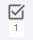

# Associer les cas de test aux exigences

Le bloc **Exigences vérifiées par ce cas de test**, permet d’associer à chaque cas de test, une ou plusieurs exigences. Cette fonction est capitale pour établir la couverture des exigences par les cas de test.
 Il existe 2 façons de réaliser cette assosciation :

## Associer des exigences à un cas de test en utilisant la bibliothèque

En cliquant sur le bouton {class="icone"}, il est possible, via un glisser-déposer depuis le volet 'Référentiel des Exigences' vers la page de consultation du cas de test, d'ajouter une ou plusieurs exigences dans la table 'Exigences vérifiées par ce cas de test'. 

{class="pleinepage"}

## Associer des exigences à un cas de test en utilisant la recherche

Le bouton {class="icone"} permet d'ajouter à la table 'Exigences vérifiées par ce cas de test' une ou plusieurs exigences via l'outil de recherche :

- Dans la partie gauche, il est possible d'ajouter des filtres et autres critères de recherche.
- Dans la partie droite, la liste des exigences correspondantes s'affiche. Il est alors possible de lier toutes les exigences recherchées via {class="icone"} ou seulement une sélection via {class="icone"}.

{class="pleinepage"}

Une fois liée au cas de test, l'exigence et ses attributs apparaissent dans la table. Un lien cliquable sur le nom de l'exigence permet d'accéder à la page de consultation de celle-ci.

{class="pleinepage"}

L'ancre du bloc 'Exigences vérifiées par ce cas de test' se met automatiquement à jour avec le nombre d'exigences liées :  {class="icone"}.

Une fois lié, le cas de test apparaît également dans la table 'Cas de test vérifiant cette exigence' des exigences associées.