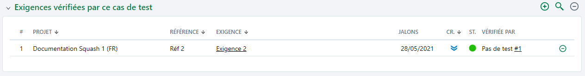

# Associer les cas de test aux exigences

## Associer des exigences à un cas de test en utilisant la bibliothèque

Pour couvrir une exigence par un cas de test, il faut lier le cas de test à l'exigence qu'il vérifie. Cette fonction est capitale pour établir la couverture des exigences par les cas de test, reprise dans l’espace Pilotage.

L'association d'exigence à un cas de test se fait depuis l'ancre **Exigences vérifiées par ce cas de test** d'un cas de test.

En cliquant sur le bouton , il est possible, via un glisser-déposer depuis le volet 'Référentiel des Exigences' qui s'affiche à droite vers la page de consultation du cas de test, d'ajouter une ou plusieurs exigences dans la table 'Exigences vérifiées par ce cas de test'.  

 

Une fois liée au cas de test, l'exigence et ses attributs apparaissent dans la table. Un lien cliquable sur le nom de l'exigence permet d'accéder à la page de consultation de celle-ci. 
 L'ancre 'Exigences vérifiée par ce cas de test' se met à jour automatiquement avec le nombre d'exigences liées :  

Une fois lié à l'exigence, le cas de test apparaît également dans la table 'Cas de test vérifiant cette exigence' de l'exigence associée.

## Associer des exigences à un cas de test en utilisant la recherche

L'association d'exigence(s) à un cas de test peut se faire depuis l'ancre **Exigences vérifiées par ce cas de test** de l'espace **Cas de test** grâce à la recherche.

Le bouton  permet d'ajouter à la table 'Exigences vérifiées par ce cas de test' une ou plusieurs exigences via l'outil de recherche.

- Dans la partie gauche de l'écran, il est possible d'ajouter des filtres et autres critères de recherche.
- Dans la partie droite, la liste des exigences correspondantes s'affiche. Il est alors possible de lier toutes les exigences recherchées ou seulement une sélection.

 

Une fois liée au cas de test, l'exigence et ses attributs apparaissent dans la table. 

 

L'ancre se met à jour avec le nombre d'exigence(s) liée(s) :  

Une fois lié à l'exigence, le cas de test apparaît également dans la table 'Cas de test vérifiant cette exigence' de l'espace **Exigences**.