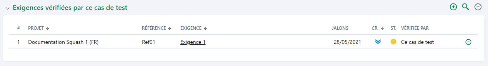

# Associer une/des exigences à un cas de test en utilisant la bibliothèque

L'association d'exigence(s) à un cas de test peut se faire depuis l'ancre **Exigences vérifiées par ce cas de test** de l'espace **Cas de test**.

En cliquant sur le bouton , il est possible via un glisser-déposer d'ajouter une ou plusieurs exigences dans la table 'Exigences vérifiées par ce cas de test'.  

 

Une fois liée au cas de test, l'exigence et ses attributs apparaissent dans la table. 
L'ancre se met à jour avec le nombre d'exigence(s) liée(s) :  

Une fois lié à l'exigence, le cas de test apparaît également dans la table 'Cas de test vérifiant cette exigence' de l'espace **Exigences**.