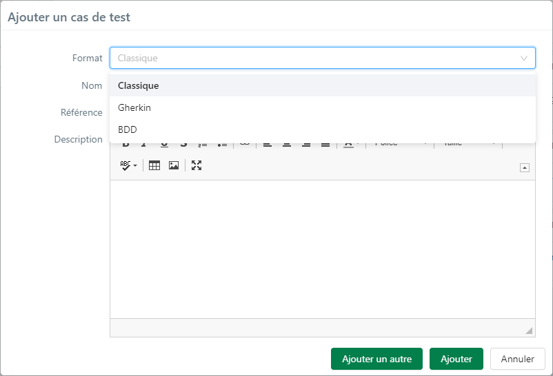
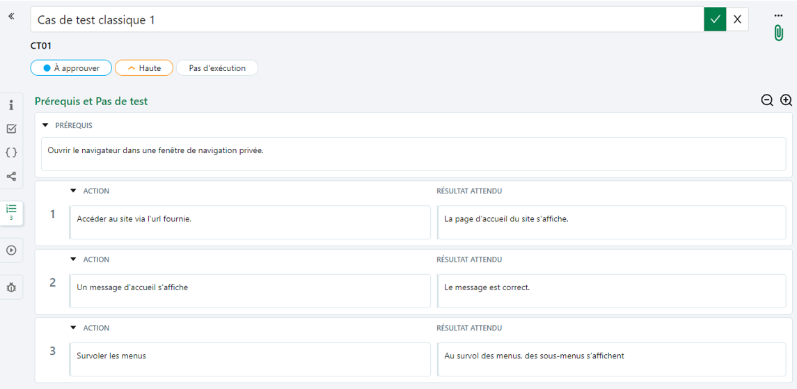
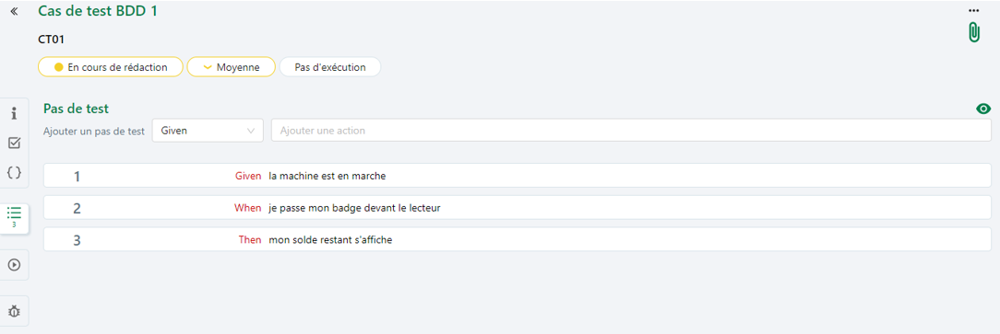
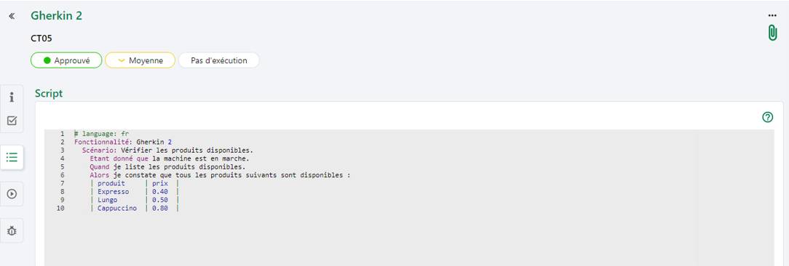
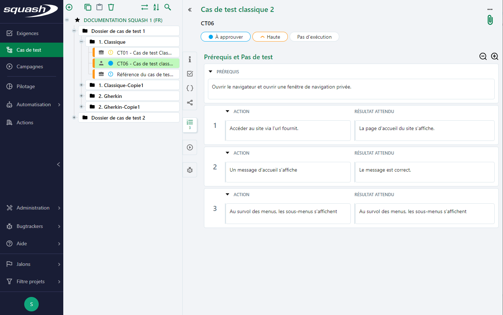

# Les cas de test dans Squash

## Qu’est ce qu’un cas de test ?

Un cas de test est "un ensemble de valeurs d‘entrée, de pré-conditions d‘exécution, de résultats attendus et de post-conditions d‘exécution, développé pour un objectif ou une condition de test particulier, tel qu‘exécuter un chemin particulier d‘un programme ou vérifier le respect d‘une exigence spécifique" (ISTQB) <a href="#fn:1" rel="footnote">1</a>.

Chaque cas de test a pour objectif à minima de vérifier le résultat attendu spécifié par une exigence.

Dans Squash, un cas de test est un objet de l’Espace **Cas de test**. Il est définit par un prérequis de départ, des jeux de données à constituer, des actions à réaliser et des résultats attendus. L'exécution d'un cas de test doit permettre de vérifier, étape par étape, la conformité d'un comportement attendu d'un système testé et ainsi d'identifier d'éventuelles anomalies. 

!!! info "Info"
    Pour que la couverture de test soit optimale, il est important disposer d’une description précise du cas de test indiquant son objectif : "*Le cas de test vérifie que [action]*". Une exigence peut parfois être vérifiée par différents chemins possibles, il doit donc y avoir autant de cas de test que de scénarios identifiés.

## Les formats de cas de test dans Squash

Trois formats de cas de test sont disponibles dans Squash: Classique, BDD et Gherkin.

 

Chaque format est facilement identifiable par sa couleur dans l'espace 'Cas de test'. Dans l'arbre des cas de test, les libellés apparaissent en noir pour le format Classique, en vert pour le format BDD et en bleu pour le format Gherkin.

## Cas de test Classique
Le cas de test classique permet de décrire via des pas de test, les actions à mener et leurs résultats attendus.
Il dispose d'un bloc 'Prérequis' qui recueille les préconditions du cas de test et peut être variabilisé avec des jeux de données et factorisé via des appels de cas de test.
Il est adapté aux tests manuels mais peut également être automatisé.

## Cas de test BDD
Le cas de test BDD permet de décrire un scénario en langage Gherkin via une interface simple et intuitive proposant de l'autocomplétion <a  href="#fn:2" rel="footnote">2</a>. Chaque pas de test est composé d'un mot-clé (Given-When-Then) et d'une phrase d'action pouvant être réutilisée dans d'autres cas de test BDD.
Ce format est particulièrement adapté à l'automatisation. Il permet, sans qu'il n'y ait d'impact sur la rédaction du cas de test, d'exporter le script associé au format attendu par Cucumber ou Robot Framework, Squash se chargeant de faire la traduction. 

## Cas de test Gherkin
Le cas de test Gherkin consiste en la rédaction d'un ou plusieurs scénarios Gherkin dans un éditeur de texte dédié qui propose une coloration et une vérification syntaxique, sans autocomplétion.
Ce format est adapté à l'automatisation, le script Gherkin est exporté au format Cucumber tel qu'il a été rédigé par l'utilisateur. 

## La page de consultation d’un cas de test

La page de consultation d'un cas de test s'affiche lorsqu'un cas de test est sélectionné dans la bibliothèque des cas de test.

La page de consultation d'un cas de test est constituée:

-   du nom et de la référence
-   de capsules indiquant le statut, l'importance et le statut de la dernière exécution
-   des attributs du cas de test, de ses associations et de son contenu dans des blocs spécifiques

!!! info "Info"
	Le nom et la référence (facultative) sont déterminés lors de la création du cas de test. Avoir un cas de test avec une référence est fortement conseillé afin d'organiser son référentiel. Il est possible de modifier la référence et le nom depuis la page de consultation du cas de test.

Il est possible d'ajouter une pièce jointe via le bouton  en haut à droite de la page.

La barre des ancres à gauche, permet au clic sur une ancre, d'accéder au bloc correspondant :

###  Informations

Le bloc **Informations** affiche les attributs du cas de test: 'Statut', 'Importance', 'Type', 'Nature', et 'Format', sa description ainsi que ses champs personnalisés.

###  Exigences vérifiées par le cas de test

Le bloc **Exigences vérifiées par le cas de test** permet d'associer la ou les exigence(s) couverte(s) par le cas de test. Une table affiche les informations des exigences associées.

###  Paramètres et jeux de données
*Ce bloc s'affiche uniquement pour les cas de test au format Classique et BDD.*

Le bloc **Paramètres et jeux de données** permet de variabiliser les cas de test en valorisant leurs paramètres par des jeux de données. Les paramètres peuvent être définis au niveau des champs "Prérequis", "Action" et "Résultat attendu" pour un cas de test Classique et au niveau des actions des pas de test pour un cas de test BDD. Les jeux de données permettent de définir des ensembles de valeurs pour ces paramètres. Les paramètres renseignés dans les pas de test et prérequis sont automatiquement reportés dans la table des 'Paramètres et jeux de données'. 

###  Cas de test appelé par
*Ce bloc s'affiche uniquement pour les cas de test au format Classique.*

Le bloc **Cas de test appelé par** liste les tests qui appellent le cas de test classique courant. Le mécanisme d'appel de test dans un cas de test permet la construction de bibliothèques modulaires de cas de test. Lors de l'exécution, les pas de test du cas de test appelé sont vus comme des pas de test dans le cas de test appelant. Une table affiche les informations des cas de test "appelant".

!!! info "Info"
	Ce mécanisme peut également être utilisé pour des tests de bout en bout faisant appel au patrimoine de tests de différents projets.

###  Prérequis et pas de test
*Ce bloc s'affiche uniquement pour les cas de test au format Classique.*

Le bloc **Prérequis et pas de test** est constitué de deux parties :

- Prérequis : qui recueille les préconditions du cas de test

- Pas de test : qui se compose d'une suite d'actions à accomplir pour atteindre l'objectif du test et des résultats attendus correspondants. 

###  Script
*Ce bloc s'affiche uniquement pour les cas de test au format Gherkin.* 

Au clic, le bloc **Script** devient éditable et permet de rédiger des scénarios Gherkin via l'utilisation de snippets. 
Une aide à la rédaction des cas de test Gherkin est disponible au clic sur le bouton [Aide]. 

###  Pas de test
*Ce bloc s'affiche uniquement pour les cas de test au format BDD.*

Il permet d'ajouter des pas de test se basant sur la synthaxe Gherkin en choississant un Mot-clé dans la liste déroulante et un rédigeant une Action.

###  Exécutions

Le bloc **Exécutions** liste les exécutions du cas de test et leurs attributs (statut, identifiant du testeur ayant exécuté le cas de test, date de l'éxecution et nombre d'anomalies remontées). La table est alimentée automatiquement, en temps réel et ne peut être modifiée.

###  Anomalies connues

La table **Anomalies connues** <a href="#fn:3" rel="footnote">3</a> liste les anomalies déclarées lors de l’exécution des cas de test. La table est alimentée automatiquement et en temps réel par le bugtracker et ne peut être modifiée. Deux liens cliquables permettent à l'utilisateur d'accéder à :

-   la page de consultation de l’anomalie dans le bugtracker
-   la page de consultation de l’exécution durant laquelle l’anomalie a été relevée

<ol>
<li id="fn:1">

En anglais "International Software Testing Qualifications Board", l'ISTQB est le Comité international de qualification du test logiciel.<a href="#fnref:1" rev="footnote">&#8617;</a>
</li>
<li  id="fn:2">

Disponible via le plugin Bibliothèque d'actions.<a  href="#fnref:2"  rev="footnote">&#8617;</a>
</li>
<li  id="fn:3">

Cette ancre s'affiche uniquement lorsqu'un bugtracker est associé au projet du cas de test.<a  href="#fnref:3"  rev="footnote">&#8617;</a>
</li>
</ol>

