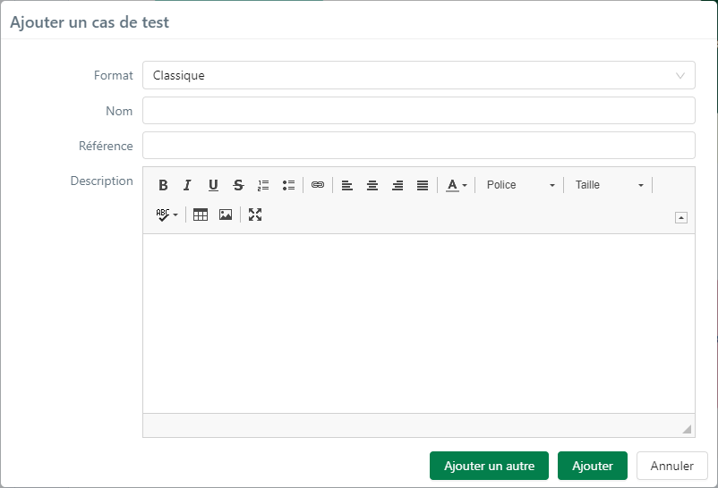

# Créer et organiser le patrimoine de cas de test

## Créer un cas de test

La création d'un cas de test se fait depuis l'espace Cas de test.

Il est possible de créer un cas de test à la racine d'un projet ou d'un dossier.

Lors de la création, il est obligatoire de renseigner le format du cas de test (Classique, Gherkin ou BDD) et de saisir, à minima, une valeur pour le champ 'Nom'. Si des champs personnalisés obligatoires sont associés à l'objet Cas de test, ils apparaissent également dans la popup afin d'être renseignés.

Il est recommandé d'ajouter une référence et une description au cas de test même si ces champs sont facultatifs. 

!!! info "Info"
	Une fois le cas de test créé, le 'Format' ne peut plus être modifié mais les champs 'Nom', 'Référence' et 'Description' restent modifiables.

## Créer des cas de test à partir des exigences

Pour gagner en temps et maximiser la couverture de tests, il est possible de créer des cas de test à partir des exigences.

Pour cela, il faut :

- Sélectionner la ou les exigence(s) dans l'espace Exigences. Il est possible de sélectionner un ou plusieurs dossiers d'exigences
- Cliquer sur le bouton **[Copier]** 
- Dans l'espace Cas de test, sélectionner l'emplacement de destination des cas de test puis cliquer sur le bouton **[Importer/Exporter]** 
- Sélectionner l'option 'Ajouter des cas de test à partir des exigences sélectionnées' et choisir le format du ou des cas de test qui seront créé(s)
- Une arborescence de cas de test identique à l’arborescence d’exigences sélectionnée est créée dans le format choisi.

Le cas de test créé à partir de l'exigence reprend : 

- Le nom de l'exigence
- Sa référence
- Sa description 
- Son importance en 'auto' à partir de sa criticité

Le cas de test est automatiquement associé à cette exigence et aura par défaut le statut 'En cours de rédaction'.

!!! info "Info"
	La création de cas de test à partir d’exigences prend en compte le lien mère/filles entre exigences. Un cas de test est créé à l'identique de l'exigence mère ainsi qu'un dossier reprenant la référence et le nom de l'exigence mère contenant les cas de test issus des exigences filles.

## Les attributs d’un cas de test

Un cas de test est caractérisé par différents attributs accessibles depuis le bloc **Informations** :

!!! info "Info"
	Il est recommandé de remplir les attributs de manière homogène sur l'ensemble des projets afin d'identifier plus facilement les tests à inclure aux plans d'exécution et d'optimiser la priorisation des exécutions.  
	
### Référence

La référence du cas de test est facultative, néanmoins elle permet d'organiser son référentiel. Des conventions de nommage doivent être définies pour organiser et identifier les cas de test.

### Statut

Le champ 'Statut' permet d'affecter un statut au cas de test. Par défaut, il sera "En cours de rédaction’". Chaque statut est représenté par une couleur facilement identifiable dans la bibliothèque des cas de test grâce à la pastille qui précède la référence ou, s'il n'y a pas de référence, le libellé du cas de test.
Le statut peut être modifié à l'aide de la liste déroulante dont les valeurs sont les suivantes :

- 

- 

- 

- 

- 

!!! info "Info"
	- Une fois validée, le cas de test peut être passé au statut **'Approuvé'**. Il est alors prêt à être intégré dans une itération pour exécution.
	- Un cas de test peut être passé au statut **'Obsolète'** lorsqu'il n'est plus conforme au système testé. Ce statut permet d'archiver le cas de test dans le référentiel sans le supprimer.
	- Le statut **'À mettre à jour'** est idéal pour identifier les cas de test qui nécessitent une modification suite à l'évolution du système testé.

### Importance

Le champ 'Importance' permet d'affecter un niveau d'importance au cas de test ('Faible' par défaut). La valeur est modifiable à l'aide de la liste déroulante dont les options sont les suivantes:

- 

- 

- 

- 

!!! warning "Focus" 
	La case "Auto" au niveau de l'importance permet de déterminer automatiquement l'importance du cas de test à partir de la criticité des exigences qu'il vérifie.

L'importance du cas de test peut être utilisé pour organiser et prioriser les exécutions mais aussi pour en analyser les résultats (taux de succès/échec en fonction de l'importance des tests, importance des tests jamais exécutés).

### Nature

Le champ 'Nature' permet de définir la nature du cas de test ('Non définie' par défaut). Elle est modifiable à l'aide de la liste déroulante.

 

Ce champ permet d'identifier les cas de test au sein du patrimoine de test en fonction de leur nature. 
 Les valeurs de ce champ sont personnalisables depuis l'administration de Squash.

### Type

La valeur du champ 'Type' permet de définir le type du cas de test ('Non défini' par défaut). Elle est modifiable à l'aide de la liste déroulante. 

Le champ type peut être utilisé pour identifier facilement un certain type de cas de test à ajouter à une campagne, comme les tests de non-régression.
 Les valeurs de ce champ sont personnalisables depuis l'administration de Squash.

!!! tip "En savoir plus"
	Pour plus d'informations sur les listes personnalisées, se référer à la page [Les listes personnalisées d'un projet](../../admin-guide/gestion-projets/configurer-projet.md#les-listes-personnalisees).

### Description

Le champ 'Description' permet de décrire l'objectif du cas de test. La description reprend les éléments à vérifier de l'exigence associée au cas de test.
 La description peut débuter par "*Le cas de test vérifie que [action]*".

### Champs personnalisés

Les champs personnalisés peuvent prendre plusieurs formes (texte, case à cocher, date, tag...). Ils peuvent être renseignés au niveau d'un dossier de cas de test, d'un cas de test ou d'un pas de test. Ils n'apparaissent dans les différents blocs que s'ils sont ajoutés dans la configuration du projet.

!!! tip "En savoir plus"
	Pour plus d'informations sur les champs personnalisés, se référer à la page [Les champs personnalisés d'un projet](../../admin-guide/gestion-projets/configurer-projet.md#les-champs-personnalises).

## Organiser le référentiel de tests

Squash TM offre plusieurs moyens visuels et méthodologiques pour organiser le référentiel et identifier facilement les tests et leurs attributs. 

### Les références

Une référence est un identifiant qui doit être unique. La référence facilite l'identification du cas de test :

- **Dans la bibliothèque**: les cas de test y sont triés par ordre alphanumérique de la référence puis du nom du cas de test.

- **Dans le plan d'exécution**: dans le cas de plusieurs cas de test de noms identiques, la référence permet de les différencier.

Pour que le référentiel soit organisé de façon cohérente, il est important de définir des régles de nommage pour les références et les noms des cas de test. 

!!! info "Info"
    La création de dossiers et sous-dossiers est également un excellent moyen d'organiser le référentiel de tests au sein d'un même projet. 
    Les dossiers peuvent aussi être triés en ajoutant une référence dans le champ 'Nom'.

*Exemple d'utilisation des références pour les dossiers et les cas de test :*

### Les icônes et les pastilles

Les icônes et les pastilles permettent, depuis la bibliothèque d'avoir une vision globale sur l'état du référentiel de tests.

Dans la bibliothèque, les cas de test s’affichent dans une capsule blanche où les éléments suivants sont présents :

- 1ère position : Un onglet coloré indique l'importance du cas de test
- 2ème position : Une icône indique la nature du cas de test
- 3ème position : Une icône indique le statut du cas de test, la présence de pas de test, et l'association à une exigence. 
    - La couleur de la pastille représente le statut du cas de test.
    - Une pastille "vide"  signifie qu'aucun pas de test n'est présent dans le cas de test. À l'inverse, une pastille "pleine"  signifie que le cas de test contient au moins un pas de test.
    - Une coche s'affiche dans la pastille  lorsqu'au moins une exigence est reliée au cas de test.

Au survol, une infobulle détaille chaque élément.

*Exemple :* 

- *Le cas de test "CT002 - Fonctionnel" a une importance "Moyenne", est de nature "Fonctionnel", a pour statut 'Approuvé', contient des pas de test et est lié à une exigence.*
- *Le cas de test "CT005-Non fonctionnel" a une importance "Haute", est de nature "Non fonctionnel", a pour statut 'En cours de rédaction', contient des pas de test mais n'est pas lié à une exigence.*
- *Le cas de test "CT007-Sécurité" a une importance "Moyenne", est de nature "Sécurité", a pour statut 'En cours de rédaction' et ne contient pas de pas de test.*

!!! info "Info"
    Pour les cas de test Gerkhin, la pastille de statut apparait toujours pleine car le script  du cas de test est pré-rempli avec la balise de langue et le titre de la fonctionnalité.

### Les couleurs

Chaque format de cas de test est représenté par une couleur de police spécifique dans la bibliothèque de l'espace Cas de test permettant leur identification rapide :

- Cas de test Classique en noir
- Cas de test Gherkin en bleu
- Cas de test BDD en vert 

### Les capsules

Des capsules sont visibles sur la page de consultation d'un cas de test, sous la référence. Elles indiquent:

- le statut du cas de test
- l'importance
- le statut de la dernière exécution

