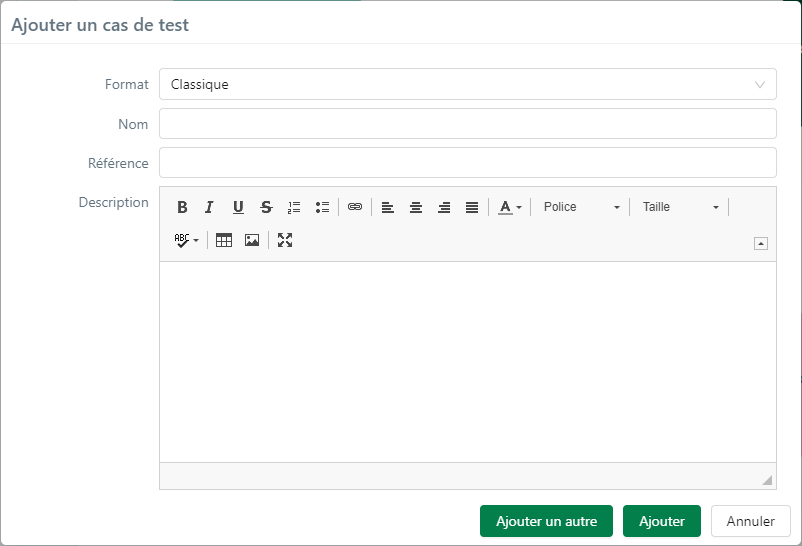

# Créer un cas de test

La création d'un cas de test se fait depuis l'espace Cas de test.

Il est possible de créer un cas de test à la racine d'un projet ou d'un dossier.

Lors de la création, il est obligatoire de renseigner le format du cas de test (Classique, Gherkin ou BDD) et de saisir, à minima, une valeur pour le champ 'Nom'. Si des champs personnalisés obligatoires sont associés à l'objet Cas de test, ils apparaissent également dans la popup afin d'être renseignés.

Il est recommandé d'ajouter une référence et une description au cas de test même si ces champs sont facultatifs. 

!!! note "Info"
	Une fois le cas de test créé, le 'Format' ne peut plus être modifié mais les champs 'Nom', 'Référence' et 'Description' restent modifiables.
