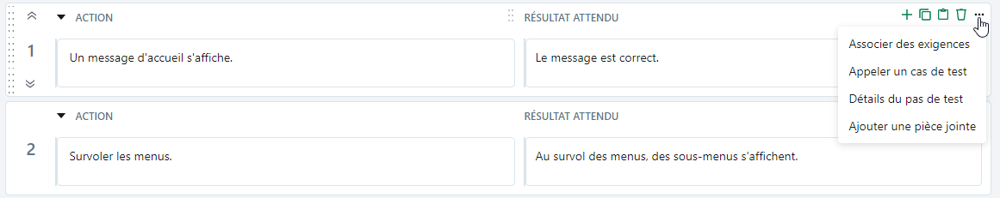
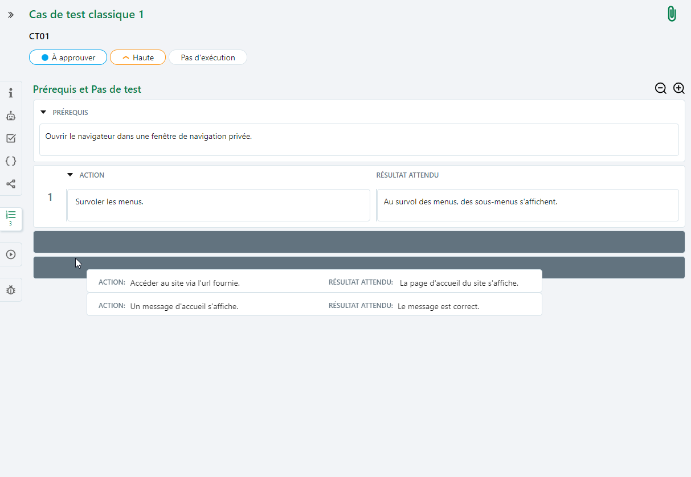

# Rédiger le scénario d'un cas de test Classique

Chaque cas de test a pour objectif à minima de vérifier le résultat attendu spécifié par une exigence. Pour atteindre cet objectif, il faut concevoir un scénario de test. Ce scénario se caractèrise par une série d'actions à réaliser sur l'outil testé pour vérifier le comportement attendu de l'outil face à ces actions. Dans Squash TM, le scénario de test d'un cas de test Classique est géré dans l'ancre **'Prérequis et pas de test'**.

## Prérequis et pas de test d’un cas de test Classique

L'ancre 'Prérequis et pas de test' {class="icone"} d'un cas de test Classique se compose de deux parties :

- un Prérequis

Ce champ accueille les préconditions du test. C'est ici que sont détaillées les actions à accomplir ou les conditions à respecter **avant** de commencer l'exécution des pas de test.

- des Pas de test

Les pas de test sont une suite d'étapes composés d'un champ 'Action' contenant les instructions à réaliser et d'un champ 'Résultat attendu' contenant les comportements attendus de l'outil.

{class="pleinepage"}

Les champs Prérequis, Action et Résultat attendu sont des champs de type texte riche dans lesquels il est possible d'ajouter une mise en forme, des tableaux, des URLs ou encore des images.

!!! warning "Focus"
    Il est fortement déconseillé d'utiliser le copier/coller pour ajouter des images dans les différents champs de texte riche de Squash TM.  
    Pour ajouter des images dans les champs Prérequis, Action et Résultat attendu, consulter la page [Insérer une image dans un champ texte riche](../../presentation-generale/fonctionnalites-objet/#inserer-une-image)

Au survol des pas de test, une barre d'icônes s'affiche en haut à droite du bloc. 
À l'aide de ces boutons, il est possible :

- d'**ajouter** {class="icone"} un pas de test (il sera ajouté directement sous le pas de test sélectionné)
- de **supprimer** {class="icone"} un pas de test
- de **copier** {class="icone"} et **coller** {class="icone"} un pas de test
- d'**associer des exigences**
- d'**appeler un cas de test**
- d'**afficher les détails** du pas de test 
- d'**ajouter une pièce jointe**. Il est aussi possible de glisser/déposer une pièce jointe directement sur le pas de test

Capture à refaire :
{class="pleinepage"}

Si le pas de test posséde des champs personnalisés, des pièces jointes ou des exigences associées, ces élements s'affichent sous les champs Action et Résultat attendu.

Le bouton {class="icone"} permet de réduire l'affichage et d'avoir une vue d'ensemble des pas de test rédigés. Tandis que le bouton {class="icone"} permet de développer l'affichage des pas de test. Pour réduire ou étendre unitairement l'affichage du prérequis ou d'un pas de test, utiliser les flèches suivantes : {class="icone"} et {class="icone"}.

{class="pleinepage"}

!!! info "Info"
    Pour copier/coller ou supprimer plusieurs pas de test à la fois, sélectionner tous les pas de test à supprimer en cliquant sur leur numéro d'ordre avec un **Ctrl+clic** puis cliquer sur le bouton corrrespondant de l'un d'eux.

## Réordonner les pas de test

Pour réordonner un ou plusieurs pas de test : 

1. Sélectionner les pas de test en cliquant sur leur numéro d'ordre avec un **Ctrl+clic**
2. Cliquer sur les deux lignes verticales en pointillé qui s'affichent avant l'un des numéros d'ordre
3. Réaliser un glisser/déposer à l'emplacement de destination

{class="pleinepage"}

!!! info "Info"
    Pour faciliter le réordonnancement des pas de test, il est recommandé de basculer en affichage réduit.

En affichage étendu, il est également possible de déplacer un pas de test d'un cran vers le haut ou vers le bas via les flèches {class="icone"} et {class="icone"} qui apparaissent au survol de ce dernier. 

## Associer une exigence à un pas de test

L'association d'une exigence à un pas de test permet d'avoir une couverture plus précise d'une exigence par les tests. 
 L'association d'une exigence à un pas de test se fait de deux façons :
 
- Via l'option 'Associer des exigences' :
    1. Cliquer sur le bouton {class="icone"} qui apparaît au survol d'un pas de test 
    2. Sélectionner l'option *'Associer des exigences'*. 
    3. L'arbre du Référentiel des exigences s'affiche à droite et permet d'associer des exigences aux pas de test par glisser-déposer.

- Via l'option 'Détails du pas de test' :
    1. Cliquer sur le bouton {class="icone"} 
    2. Sélectionnant l'option *'Détails du pas de test'*. 
    3. Sur la page 'Détails pas de test', cliquer sur le bouton {class="icone"} ou {class="icone"} pour ajouter des exigences à la table 'Exigences vérifiées par ce cas de test'
    4. Lorsqu'une exigence est associée au cas de test, la case 'Etape' est cochée par défaut, indiquant que l'exigence est également reliée au pas de test.

Une fois associée au pas de test, l'exigence associée apparaît :

- dans le pas de test, à la suite des champs 'Action' et 'Résultat attendu'.

{class="pleinepage"}

- dans la table 'Exigences vérifiées par ce cas de test' du cas de test avec le numéro du pas de test qui lui est associé dans la colonne 'Vérifiée par'.

{class="pleinepage"}

Le cas de test associé à l'exigence  apparaît quant à lui dans la table 'Cas de test vérifiant cette exigence' de l'exigence.

{class="pleinepage"}

## Rédiger un pas de test en visualisant les exigences 

Il est possible de créer, modifier et supprimer les pas de test d'un cas de test en visualisant sur la même page les exigences qui lui sont associées. Pour ce faire :

1. Cliquer sur le bouton {class="icone"} qui s'affiche au survole du pas de test
2. Sélectionner l'option *'Détails du pas de test'*
3. La page 'Détails du pas de test' s'affiche avec à gauche un espace de visualisation des exigences associées et à droite les informations du pas de test. 
4. Cliquer sur le bouton **>** pour consulter le détail des exigences

Les champs 'Action' et 'Résultat attendu' sont modifiables et il est possible d'ajouter un pas de test via le bouton {class="icone"} ou de le supprimer avec le bouton {class="icone"}.

