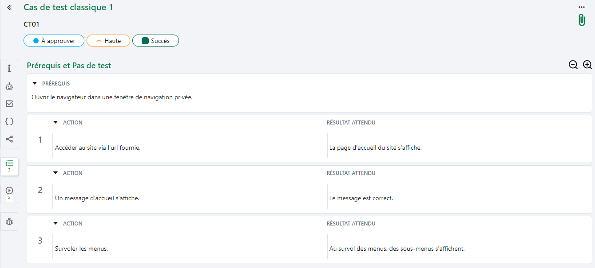
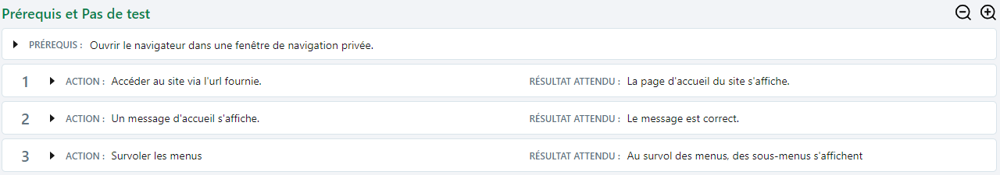
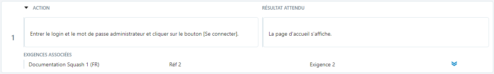
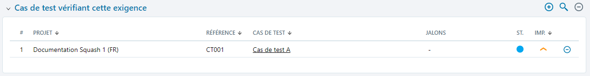
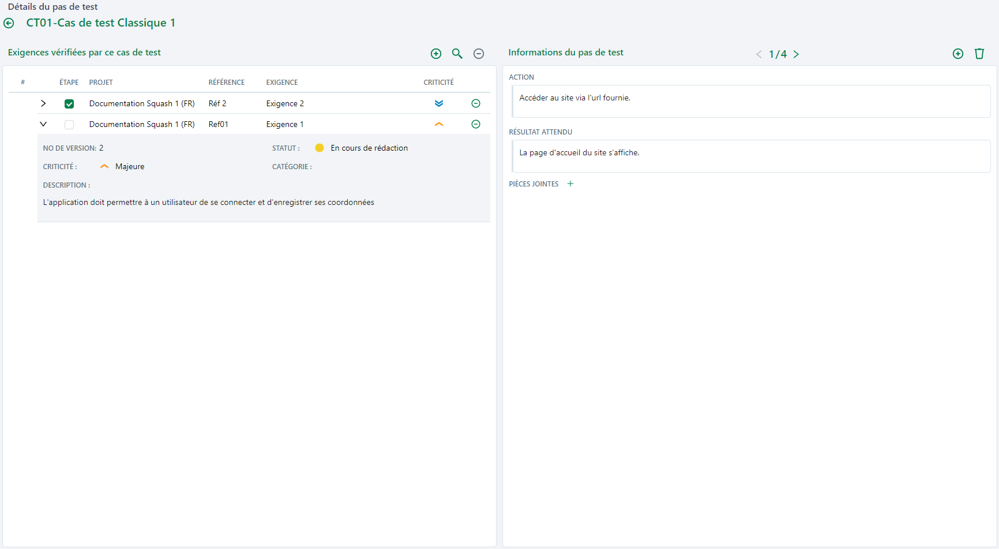

# Rédiger le scénario d'un cas de test classique

## Prérequis et pas de test d’un cas de test classique

Depuis l'espace **Cas de test**, l'ancre prérequis et pas de test  se compose de deux parties:

- une partie Prérequis

Les préconditions du cas de test. Ici, il faut détailler les actions à accomplir ou les conditions à respecter avant de commencer l'exécution des pas de test.

- une partie Pas de test

Une suite d'actions à accomplir et de résultats attendus qui permettent la bonne exécution du cas de test dans son ensemble. Ils permettent de vérifier les spécifications de l'exigence liée.

Ces deux parties sont constituées de champs de texte riche dans lesquels il possible d'ajouter une mise en forme, des tableaux, des URL ou encore des images.

!!! warning "Focus"
    Il est fortement déconseillé d'utiliser le copier/coller pour ajouter des images dans les différents champs de texte riche de Squash TM.  
    Pour ajouter des images dans les champs Prérequis, Action et Résultat attendu, consulter la page [Insérer une image dans un champ texte riche](../../presentation-generale/fonctionnalites-objet/#inserer-une-image)

Au survol des pas de test, une barre d'icônes s'affiche en haut à droite du bloc. 
À l'aide de ces boutons, il est possible:

- d'**ajouter** un pas de test (il sera ajouté directement sous le pas de test sélectionné)
- de **supprimer** un pas de test
- de **copier** et **coller** un pas de test
- d'**associer des exigences**
- d'**afficher le détail** du pas de test 
- d'**ajouter une pièce jointe**

Le bouton  permet de réduire l'affichage et d'avoir une vue d'ensemble des pas de test rédigés.

Le bouton  permet de développer l'affichage des pas de test. 

## Réordonner les pas de test

Pour réordonner les pas de test, il est possible de faire un glisser-déposer ou d'utiliser les flèches  ou  qui apparaissent au survol d'un pas de test. 

Le nouvel ordre après modification sera pris en compte lors de l'exécution. 

## Associer une exigence à un pas de test

L'association d'une exigence à un pas de test se fait depuis l'ancre 'Prérequis et pas de test' de l'espace **Cas de test**. L'association se fait:

- En cliquant sur le bouton [...] qui apparaît au survol en haut à droite du pas de test, puis en sélectionnant l'option *"Associer des exigences"*. L'arbre du Référentiel des exigences permet d'associer une exigence à un pas de test via un glisser-déposer.

- En cliquant sur le bouton [...] puis en sélectionnant l'option *"Détails du pas de test"*. Lorsqu'une exigence est ajoutée à la table 'Exigences vérifiées par ce cas de test', la case 'Etape' est cochée par défaut, indiquant que l'exigence est reliée au pas de test.

Une fois associée au pas de test, l'exigence associée apparaît:

- dans le pas de test, sous les champs 'Action' et 'Résultat attendu'.

- dans la table 'Exigences vérifiées par ce cas de test' de l'espace **Cas de test**.

Le pas de test associé à l'exigence apparaît dans la table 'Cas de test vérifiant cette exigence' de l'espace **Exigences**.

## Rédiger un pas de test en visualisant les exigences 

En cliquant sur le bouton [...] qui apparaît au survol en haut à droite du pas de test, puis en sélectionnant l'option *'Détails du pas de test'*, il est possible de créer, modifier et supprimer des pas de test en visualisant les exigences qui sont associées. 

