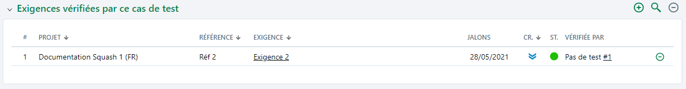

# Associer une exigence à un pas de test

L'association d'une exigence à un pas de test se fait depuis l'ancre 'Prérequis et pas de test' de l'espace **Cas de test**. 

En cliquant sur le bouton [...] puis en sélectionnant l'option *"Associer des exigences"*, l'arbre du Référentiel des exigences permet d'associer une exigence à un pas de test via un glisser-déposer.

-Une fois associée au pas de test, l'exigence associée apparaît:

- dans le pas de test, sous les champs 'Action' et 'Résultat attendu'

- dans la table 'Exigences vérifiées par ce cas de test' de l'espace **Cas de test** 

Le pas de test associé à l'exigence apparaît:

- dans la table 'Cas de test vérifiant cette exigence' de l'espace **Exigences**.

