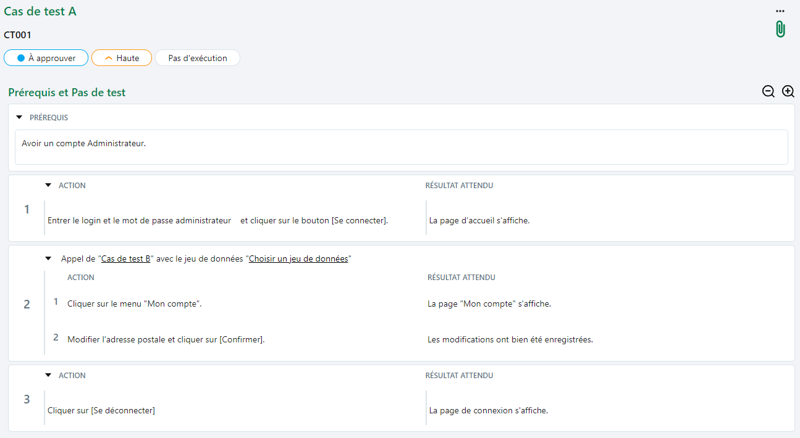

# Factoriser : Appeler un cas de test tiers 

## Appeler un cas de test

Le mécanisme d'appels de tests dans un cas de test permet la construction de bibliothèques modulaires de cas de test. Lors de l'exécution, les pas de test du cas de test appelé sont vu comme des pas de test dans le cas de test appelant.

Ce mécanisme peut également être utilisé pour des tests de bout en bout faisant appel au patrimoine de tests de différents projets.

L'appel de cas de test se fait depuis l'ancre 'Prérequis et Pas de test'  de l'espace **Cas de test** et peut être ajouté avant ou après n’importe quel pas de test.

Il est possible d’appeler un cas de test de deux façons :

-	En le sélectionnant dans la bibliothèque des cas de test puis en faisant un glisser-déposer. 
-	En cliquant sur le bouton […] en haut à droite du pas de test puis en cliquant sur l’option « Appeler un cas de test » et en faisant un glisser-déposer.

!!! note "Info"
    Il n’est pas possible d’appeler un cas de test Gherkin ou BDD.

Les cas de tests appelants sont listés dans le bloc « Cas de test appelé par » dans l'onglet ‘Informations' du cas de test appelé.

*Exemple : 
Le Cas de test B est appelé dans le Cas de test A c'est à dire que les pas de test contenus dans le Cas de test B se retrouvent dans le Cas de test A.*

*Le Cas de test A (cas de test appelant) s'affiche dans le bloc "Cas de test appelé par" dans l'onglet 'Informations' du Cas de test B (cas de test appelé).*

## Choisir un jeu de données

Lors d'un appel de cas de test avec jeux de données, Squash TM permet de choisir:

- d'hériter d'un des jeux de données du cas de test appelé.
- d'hériter des paramètres du cas de test appelé sans ses jeux de données

En choisissant l'option "Choisir un jeu de données parmi ceux du cas de test appelé", lors de l'exécution le paramètre sera automatiquement remplacé par la valeur du jeu de données choisie.

En choisissant l'option "Ne pas choisir de jeux de données parmi ceux du cas de test appelé (paramètres délégués)" : les paramètres du cas de test appelé sont ajoutés aux paramètres du cas de test appelant.
La valeur de ces paramètres doit être définie au niveau de ce cas de test.