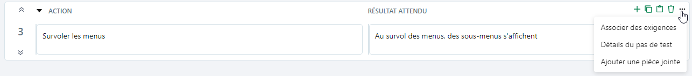

# Prérequis et pas de test d’un cas de test classique

Depuis l'espace **Cas de test**, l'ancre prérequis et pas de test  se compose de deux parties:

- une partie Prérequis

Les préconditions du cas de test. Ici, il faut détailler les actions à accomplir ou les conditions à respecter avant de commencer l'exécution des pas de test.

- une partie Pas de test

Une suite d'actions à accomplir et de résultats attendus qui permettent la bonne exécution du cas de test dans son ensemble. Ils permettent de vérifier les spécifications de l'exigence liée.

Ces deux parties sont constituées de champs de texte riche dans lesquels il possible d'ajouter une mise en forme, des tableaux, des URL ou encore des images.

!!! warning "Focus"
    Il est fortement déconseillé d'utiliser le copier/coller pour ajouter des images dans les différents champs de texte riche de Squash TM.  
    Pour ajouter des images dans les champs Prérequis, Action et Résultat attendu, il faut d'abord les ajouter en pièce-jointes du cas de test ou du pas de test puis les ajouter dans le champ de texte riche souhaité en utilisant le bouton  et en ajoutant l'URL de l'image à joindre.

Au survol des pas de test, une barre d'icônes s'affiche en haut à droite du bloc. 
À l'aide de ces boutons, il est possible:

- d'**ajouter** un pas de test (il sera ajouté directement sous le pas de test sélectionné)
- de **supprimer** un pas de test
- de **copier** et **coller** un pas de test
- d'**associer des exigences**
- d'**afficher le détail** du pas de test 
- d'**ajouter une pièce jointe**

Le bouton  permet de réduire l'affichage et d'avoir une vue d'ensemble des pas de test rédigés.

Le bouton  permet de développer l'affichage des pas de test. 