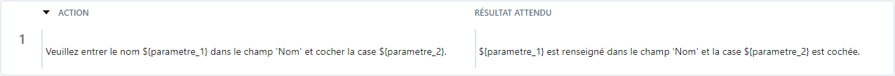

# Variabiliser un cas de test classique

Squash TM permet de variabiliser et de valoriser des pas de test par une gestion des paramètres et des jeux de données. 

## Paramètres 

Pour être considéré comme tel, un paramètre doit se présenter sous la forme : **${‘Nom_du_parametre’}**.

!!! warning "Focus"
    Le nom du paramètre doit contenir exclusivement les caractères suivants: [0-9], [a-z], [A-Z] et [-,_] et ne doit comprendre aucun espace, caractère spécial ou accentué.

Un paramètre peut également être ajouté au bloc "Prérequis" du cas de test. Il s'écrira sous la même forme que pour un pas de test.

Les paramètres créés sont automatiquement répertoriés dans la table de l'ancre **Paramètres et jeux de données**   et le nom de chaque paramètre est repris en en-tête de colonne.

Il est possible d'ajouter de nouveaux paramètres directement depuis cette table mais ils ne seront pas utilisés s'ils ne sont pas présents dans le prérequis ou les pas de test du cas de test.
Il est donc recommandé de renseigner les paramètres directement dans les prérequis ou les pas de test afin qu'ils soient automatiquement récupérés dans le bloc "Paramètres et jeux de données".

## Jeux de données

Il est possible d’ajouter un ou plusieurs jeux de données à un cas de test à partir de la table **Paramètres et jeux de données** en cliquant sur le bouton [Ajouter un jeu de données] et en renseignant la valeur qui remplacera le ou les paramètres.

Les jeux de données ajoutés sont automatiquement mis à jour dans la table **Paramètres et jeux de données**.

Pendant l'exécution du cas de test, le paramètre sera remplacé par la valeur du jeu de données.

!!! note "Info"
    Lorsqu'on intègre au Plan d’exécution (Espace Campagnes) un cas de test possédant plusieurs jeux de données, il se créera dans la campagne autant de lignes (et donc de tests) qu'il y'a de jeux de données, sauf il est précisé quel(s) jeu(x) de données doit(vent) être testé(s).
