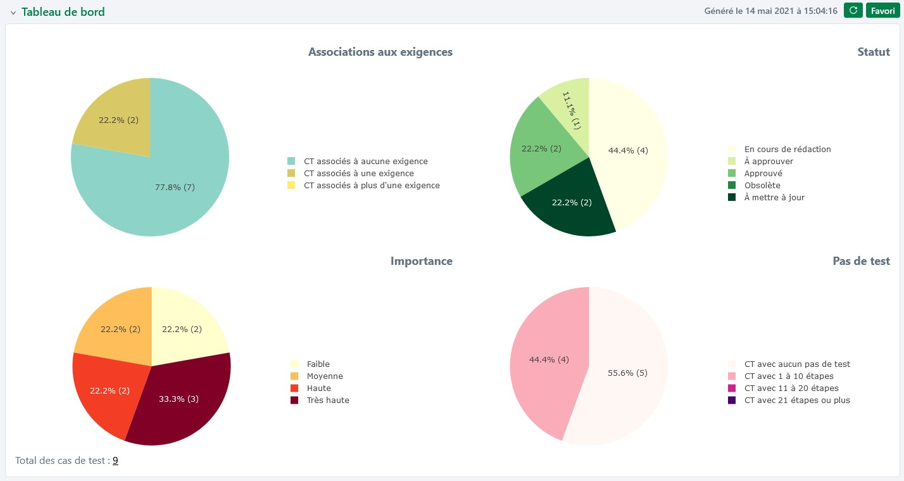

# Tableau de bord des cas de test

En sélectionnant des éléments dans la bibliothèque des cas de test, un tableau de bord s'affiche sur la page de consultation. Il est possible d’afficher un tableau de bord par défaut ou un tableau de bord personnalisé à l'aide du bouton **[Favori]**/**[Défaut]**.

!!! info "Info"
    Le tableau de bord s'affiche automatiquement lors de la sélection d'un projet ou d'un dossier. 
    Lors d'une sélection multiple (projets, dossiers, cas de test), il est nécessaire de rafraîchir le tableau de bord pour l'afficher.

!!! tip "En savoir plus"
    Pour plus de renseignements sur le tableau de bord personnalisé, consulter la page "[Les tableaux de bord personnalisés](../pilotage-recette/tableaux-bord-perso.md)"

## Les différents graphiques

Le tableau de bord par défaut des cas de test est composé de 4 graphiques :

- **Graphique 'Associations aux exigences'**

Répartition des cas de test en fonction de leur association à aucune, une ou plusieurs exigences. Ce graphique est très utile pour vérifier la couverture fonctionnelle de l'application et permet d'identifier les cas de test qui ne couvrent aucune exigence. 

- **Graphique 'Statut'**

Répartition des cas de test en fonction de leur statut de rédaction. Ce graphique permet d'avoir une vue d'ensemble de l'avancement de la rédaction des cas de test.

- **Graphique 'Importance'** 

Répartition des cas de test en fonction de leur importance. 

- **Graphique 'Pas de test'** 

Répartition des cas de test en fonction du nombre de pas de test. Ce graphique permet de contrôler l'homogénéité de la taille des cas de test pour mieux appréhender la charge. Il permet également d'identifier rapidement les cas de test qui n'ont pas de pas de test et qui ne peuvent donc pas être exécutés.

!!! info "Info"
    Les cas de test Gherkin sont considérés comme n'ayant aucun de pas de test, et sont donc présents dans la portion "CT avec aucun pas de test"

## Accès à la page de recherche

Au clic sur les portions d'un graphique du tableau de bord par défaut, une page de recherche s'affiche avec les critères présélectionnés et les résultats correspondant à la portion de graphique.

**Par exemple :**
   Au clic sur la portion de graphique "CT avec aucun pas de test" du graphique "Pas de test", une page de recherche s'affiche avec le critère "Nombre de pas de test : Egal 0". 
  En cliquant sur le bouton  ou le bouton  il est possible de modifier directement le cas de test en y ajoutant des pas de test.

!!! info "Info"
    Cette fonctionnalité n'est pas disponible pour les tableaux de bord personnalisés