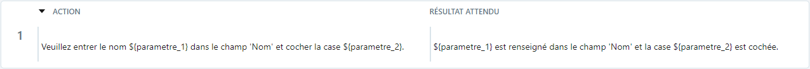
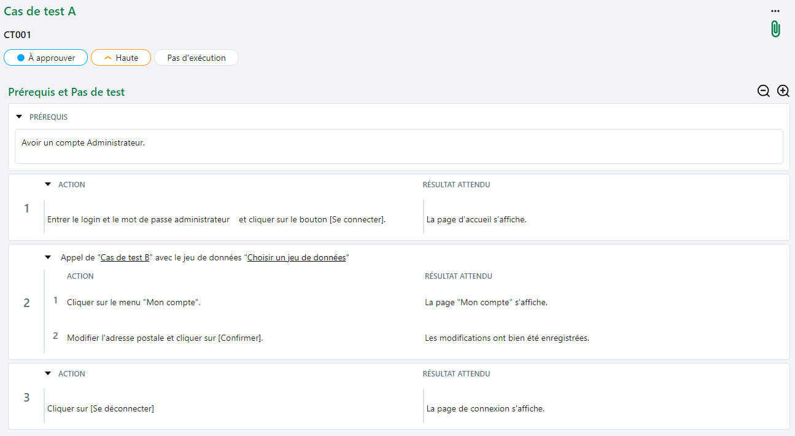

# Variabiliser et modulariser un cas de test classique

## Variabiliser un cas de test classique

Squash TM permet de variabiliser et de valoriser des pas de test par une gestion des paramètres et des jeux de données. 

### Paramètres 

Pour être considéré comme tel, un paramètre doit se présenter sous la forme : **${‘Nom_du_parametre’}**.

!!! warning "Focus"
    Le nom du paramètre doit contenir exclusivement les caractères suivants: [0-9], [a-z], [A-Z] et [-,_] et ne doit comprendre aucun espace, caractère spécial ou accentué.

Un paramètre peut également être ajouté au bloc "Prérequis" du cas de test. Il s'écrira sous la même forme que pour un pas de test.

Les paramètres créés sont automatiquement répertoriés dans la table de l'ancre **Paramètres et jeux de données**   et le nom de chaque paramètre est repris en en-tête de colonne.

Il est possible d'ajouter de nouveaux paramètres directement depuis cette table mais ils ne seront pas utilisés s'ils ne sont pas présents dans le prérequis ou les pas de test du cas de test.
Il est donc recommandé de renseigner les paramètres directement dans les prérequis ou les pas de test afin qu'ils soient automatiquement récupérés dans le bloc "Paramètres et jeux de données".

### Jeux de données

Il est possible d’ajouter un ou plusieurs jeux de données à un cas de test à partir de la table **Paramètres et jeux de données** en cliquant sur le bouton [Ajouter un jeu de données] et en renseignant la valeur qui remplacera le ou les paramètres.

Les jeux de données ajoutés sont automatiquement mis à jour dans la table **Paramètres et jeux de données**.

Pendant l'exécution du cas de test, le paramètre sera remplacé par la valeur du jeu de données.

!!! info "Info"
    Lorsqu'on intègre au Plan d’exécution (Espace Campagnes) un cas de test possédant plusieurs jeux de données, il se créera dans la campagne autant de lignes (et donc de tests) qu'il y'a de jeux de données, sauf il est précisé quel(s) jeu(x) de données doit(vent) être testé(s).

## Modulariser : Appeler un cas de test tiers

### Appeler un cas de test

Le mécanisme d'appel de tests dans un cas de test permet la construction de bibliothèques modulaires de cas de test. Lors de l'exécution, les pas de test du cas de test appelé sont vu comme des pas de test dans le cas de test appelant.

Ce mécanisme peut aussi être utilisé pour des tests de bout en bout faisant appel au patrimoine de tests de différents projets.

L'appel de cas de test se fait depuis l'ancre 'Prérequis et Pas de test'  de l'espace **Cas de test**. Un cas de test appelé peut être ajouté avant ou après n’importe quel pas de test.

Il est possible d’appeler un cas de test de deux façons :

-	En le sélectionnant dans la bibliothèque des cas de test puis en faisant un glisser-déposer. 
-	En cliquant sur le bouton […] en haut à droite du pas de test puis en cliquant sur l’option « Appeler un cas de test » et en faisant un glisser-déposer.

!!! info "Info"
    Il n’est pas possible d’appeler un cas de test Gherkin ou BDD.

Les cas de tests appelants sont listés dans le bloc « Cas de test appelé par » dans l'onglet ‘Informations' du cas de test appelé.

*Exemple : 
Le Cas de test B est appelé dans le Cas de test A c'est à dire que les pas de test contenus dans le Cas de test B se retrouvent dans le Cas de test A.*

*Le Cas de test A (cas de test appelant) s'affiche dans le bloc "Cas de test appelé par" dans l'onglet 'Informations' du Cas de test B (cas de test appelé).*

### Choisir un jeu de données

Lors d'un appel de cas de test avec jeux de données, Squash TM permet de choisir:

- d'hériter d'un des jeux de données du cas de test appelé.

En choisissant l'option *"Choisir un jeu de données parmi ceux du cas de test appelé"*, lors de l'exécution le paramètre est automatiquement remplacé par la valeur du jeu de données choisi.

- d'hériter des paramètres du cas de test appelé sans ses jeux de données.

En choisissant l'option *"Ne pas choisir de jeux de données parmi ceux du cas de test appelé (paramètres délégués)"*, les paramètres du cas de test appelé sont ajoutés aux paramètres du cas de test appelant.
La valeur de ces paramètres doit être définie au niveau de ce cas de test.