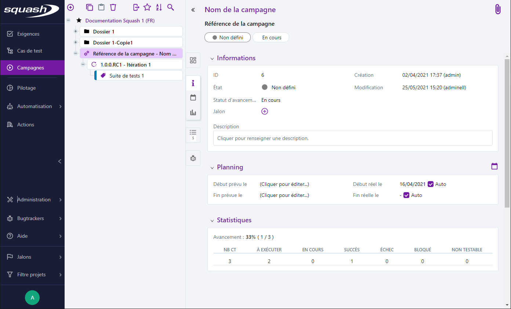
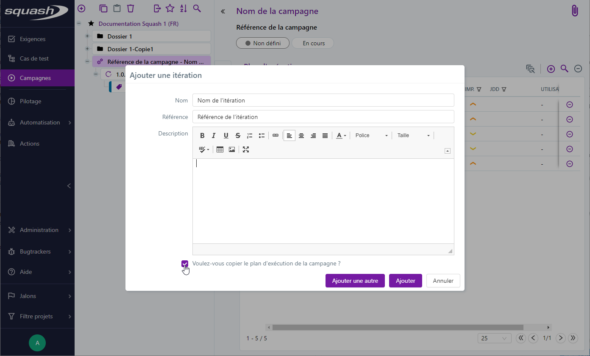
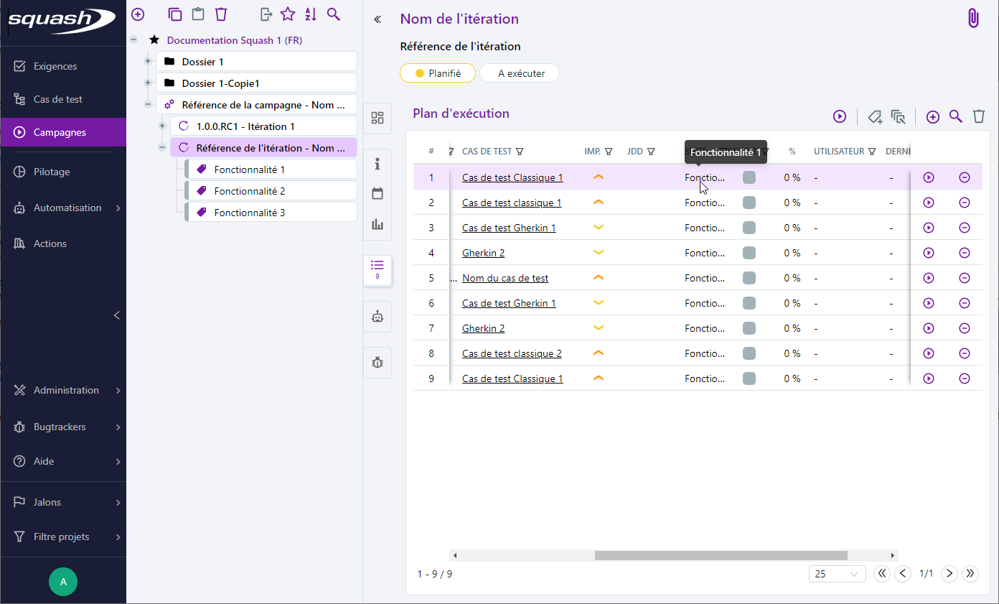

# Les objets de l'espace Campagnes

## Qu’est ce qu’une campagne, une itération et une suite de tests ?
La phase d’exécution ou « campagne » dans Squash est régie par certains principes :
 - une campagne démarre lors de la première livraison de développement et se termine au moment de la mise en production (MEP).
 - une campagne (ou phase d’exécution) est découpée en itérations (ou cycles).
 - chaque itération est définie par le laps de temps entre deux livraisons de développements (évolutions et/ou corrections).

### La campagne
Une campagne est définie par un libellé, une référence, une description et des dates de début et de fin d'exécution. Lorsque les cases "auto" sont cochées, les dates de première et dernière exécutions seront automatiquement renseignées.
Une campagne est un élément organisationnel : bien qu'il est possible d'alimenter son plan d'exécution par des cas de test, il n'est en revanche pas possible d'exécuter des tests depuis une campagne.

{class="pleinepage" }

### L'itération
L'itération est également définie par son libellé, sa référence, sa description, des dates de début et de fin d'exécution et un plan de test.
Elle est dite opérationnelle puisqu'elle permet, depuis son plan de tests, d'exécuter les tests associés.

Lors de la création d'une itération pour une campagne, les cas de test présents dans le plan d'exécution pourront être ajoutés au plan d'exécution de l'itération.

{class="pleinepage" }

### La suite
La suite permet d'organiser le plan d'exécution d'une itération, par exemple pour regrouper des tests par fonctionnalité ou par type.

{class="pleinepage" }

## La page de consultation des objets de l’espace Campagnes 

