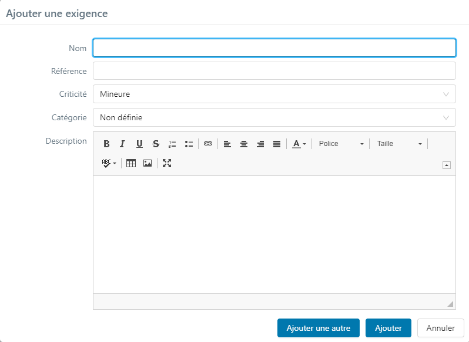

# Créer et Organiser le référentiel d’exigences

## Créer une exigence 

La création d'une exigence se fait depuis l'espace Exigences via le bouton  :

Il est possible de créer une exigence à la racine d'un projet, d'un dossier ou d'une exigence.

À la création, il est obligatoire de renseigner, à minima, une valeur pour le champ 'Nom'. 

Il est recommandé de renseigner une référence et une description à l'exigence même si ces champs sont facultatifs. 
 En l'absence de sélection dans les champs 'Criticité' et 'Catégorie' la valeur par défaut sera appliquée.

Si des champs personnalisés obligatoires sont associés à l'entité Exigences, ils apparaissent également dans la popup afin d'être renseignés à la création.

## Les attributs d’une exigence 

Une exigence est caractérisée par différents attributs accessibles sur la page de consultation de l'exigence, en particulier depuis le bloc **Informations**.

### Référence
La référence d'une exigence permet d'organiser le référentiel. Des conventions de nommage doivent être définies pour organiser et identifier les exigences.

### N° version
Le numéro de version de l'exigence, géré par le système, est un lien cliquable qui permet d’accéder à la page de 'Gestion des versions de l'exigence', sur laquelle la liste des versions de l'exigence est disponible.

###  Statut

Le champ 'Statut' permet d'affecter un statut à une exigence ('En cours de rédaction' par défaut). Le statut est modifiable à l'aide de la liste déroulante dont les valeurs sont les suivantes :

-  En cours de rédaction 
-  À approuver  
-  Approuvée
-  Obsolète

###  Criticité
Le champ 'Criticité' permet d'affecter une criticité à une exigence ('Mineure' par défaut). La criticité est modifiable à l'aide de la liste déroulante dont les valeurs sont les suivantes :

-  Critique
-  Majeure
-  Mineure
-  Non définie

###  Catégorie
Le champ 'Catégorie' permet d'affecter une catégorie à une exigence ('Non définie' par défaut). La catégorie est modifiable à l'aide de la liste déroulante dont les valeurs sont les suivantes :

- Fonctionnelle
- Non fonctionnelle
- Cas d’utilisation
- Métier
- Exigence de test
- Non définie
- Ergonomique
- Performance
- Technique
- User story
- Sécurité

!!! info "Info"
    Par exemple, la valeur 'Technique' pourra être sélectionnée dans le champ 'Catégorie' d'une exigence qui traduit les spécifications d'une fonctionnalité technique d'une application à tester. 'Fonctionnelle' pourra être sélectionné pour une exigence relevant d'un aspect fonctionnelle de l'application à tester.

Les valeurs de ce champ sont personnalisables depuis l'administration de Squash à l'aide d'une liste personnalisée.

!!! tip "En savoir plus"
	Pour plus d'informations sur les listes personnalisées, consulter la page [Les listes personnalisées d'un projet](../../admin-guide/gestion-projets/configurer-projet.md#les-listes-personnalisees) du guide administrateur.

### Jalons

Lorsque l'utilisation des jalons est activée, le champ 'Jalons' permet d'associer l'exigence à un ou plusieurs jalons via le bouton . L'association a un ou plusieurs jalons permet d'organiser le référentiel d'exigences.

###  Description
Le champ 'Description' permet de décrire l'exigence attendu du système à tester. La description doit détailler le comportement attendu du système pour répondre au besoin des utilisateurs.
Elle peut être rédigée sous la forme : "L'application doit permettre de [action]".

### ID exigence et ID version
L'ID exigence est l'identifiant technique de l'exigence en base de données. Une même exigence pouvant exister sous différentes versions, l'ID version est l'identifiant technique de la version d'exigence.
 Ces 2 champs ne sont pas éditables. 

### Création et Modification
Le champ 'Création' affiche automatiquement la date de création et le login de l'utilisateur ayant créé l'exigence.
 Le champ 'Modification' affiche automatiquement la date de dernière modification avec le login du dernier utilisateur a avoir modifié l'exigence.
 Les 2 champs ne sont pas éditables.

### Champs personnalisés
Les champs personnalisés peuvent prendre plusieurs formes : texte simple ou riche, case à cocher, liste déroulante, date, tag ou numérique. Une fois paramétrés sur l'entité 'Exigence' du projet par un chef de projet, ils apparaissent sous le champ 'Jalons' du bloc **Informations**.

!!! tip "En savoir plus"
	Pour plus d'informations sur les champs personnalisés, consulter la page [Les champs personnalisés d'un projet](../../admin-guide/gestion-projets/configurer-projet.md#les-champs-personnalises) du guide administrateur.

## Workflow exigence 

Les valeurs du champ 'Statut' d'une exigence sont la représentation d'un workflow de conception et de validation : 

1. Le statut **'En cours de rédaction'** est le statut par défaut d'une exigence. Ce statut permet d'identifier les exigences en cours de conception.
2. Une fois rédigée, une exigence est passée au statut **'À approuver'** afin d'être validée. Une relecture des exigences pour validation de l'équipe MOA ou du PO est recommandée.
3. Le statut **'Approuvée'** est attibué à l'exigence après validation. Ce statut a pour effet de bloquer toutes modifications de l'exigence. Elle est prête à être associée à un ou plusieurs cas de test.
4. Une exigence est passée au statut **'Obsolète'**, lorsqu'elle n'est plus valide suite à une évolution du système à tester. Ce statut permet d'identifier les exigences archivées sans pour autant les supprimer du référentiel.

!!! danger "Attention"
    Les statuts **'Approuvée'** ou '**'Obsolète'**' bloquent toutes modifications des attributs de l'exigence. Il convient de repasser au statut **'A approuver'** pour éditer les attributs de l'exigence.

## Historique des modifications

La table 'Historique des modifications' d'une exigence liste toutes les modifications apportées à une exigence dès lors que son statut passe de 'En cours de rédaction' à 'À approuver'.

Par exemple, la modification de la référence d'une exigence au statut 'À approuver' apparait dans cette table avec la référence d'origine, la nouvelle référence ainsi que la date, heure et login du modificateur.

## Organisation du référentiel d’exigences

A faire

## Hiérarchie d’exigences

A faire

## Liens entre exigences

A faire
