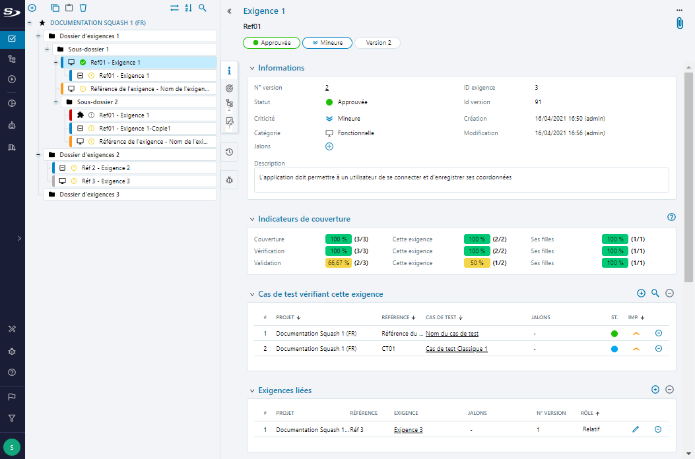

# Les exigences dans Squash TM

## Qu’est-ce qu’une exigence ?

Une exigence est "une condition ou capacité requise par un utilisateur pour résoudre un problème ou atteindre un objectif qui doit être tenu ou possédé par un système ou composant pour satisfaire à un contrat, standard, spécification ou autre document imposé formellement" (ISTQB) <a href="#fn:1" rel="footnote">1</a>. Une exigence décrit le comportement attendu d'un système (logiciel, site web, application, SI, etc) défini en amont dans un document spécifique pour répondre au besoin d'un utilisateur.

Le terme "exigence" recouvre plusieurs niveaux allant des exigences métiers (macro) aux exigences de tests (micro). Les livrables d'un projet logiciel (cahier des charges, spécifications fonctionnelles, spécifications détaillées, maquettes) permettent l'extraction des exigences. 

Dans Squash TM, une exigence est un objet de l’Espace **Exigences**. Toute exigence ou règle de gestion qualifiant un système pourra être représentée sur Squash TM sous forme d'une exigence avec la possibilité d'être qualifiée ( 'Criticité', 'Statut', 'Catégorie', ... ) pour constituer le référentiel d'exigences souhaité.

!!! info "Info"
    Une exigence doit être non ambiguë et testable : elle doit offrir un moyen de prouver que le système satisfait à son énoncé.
     Chaque exigence de test décrit un comportement attendu : elle doit pouvoir être rédigée sous la forme : "L’application doit permettre [Action]".

## La page de consultation d’une exigence

La page de consultation d'une exigence s'affiche lorsque l'exigence est sélectionnée dans la bibliothèque des exigences.

{class="pleinepage"}

La page de consultation de l'exigence est constituée :

- du nom et de la référence
- de capsules indiquant le statut, la criticité et le numéro de version de l'exigence
- des attributs de l'exigence et de ses associations dans des blocs dédiés rétractables

!!! info "Info"
	Le nom et la référence (facultative) sont déterminés lors de la création de l’exigence. Avoir une exigence avec une référence est fortement conseillé afin d'organiser son référentiel. 
 Il est possible de modifier la référence et le nom depuis la page de consultation d'une exigence. 

L'ajout d'une nouvelle version de l'exigence ou d'une pièce jointe est possible via les boutons situés en haut à droite de la page :  et 

 La barre des ancres à gauche, permet au clic sur une ancre, d'accéder au bloc correspondant :

### {class="icone"} Informations

Le bloc 'Informations' affiche les attributs de l'exigence : 'Statut', 'Criticité', 'Catégorie' et 'Description' ainsi que ses champs personnalisés.

### {class="icone"} Indicateur de couverture

Le bloc 'Indicateur de couverture' présente les indicateurs suivants :

- 'Taux de couverture' : indique le pourcentage de cas de test au statut 'À approuver' ou 'Approuvé', parmi tous les cas de test couvrant l'exigence ou l'une de ses descendantes.
- 'Taux de vérification' : indique le pourcentage de cas de test exécutés, en ne tenant compte que de la dernière exécution, parmi les cas couvrant l'exigence ou l'une de ses descendantes
- 'Taux de validation' : indique le pourcentage de cas de test ayant un statut d'exécution concluant (Succès ou Arbitré), en ne tenant compte que la dernière exécution, parmi les cas de test exécutés couvrants l'exigence ou l'une de ses descendantes.

!!! tip "En savoir plus"
	Pour plus de détails, consulter la partie [Suivre la couverture et la validation des exigences](./couverture-validation-exigences.md)

### {class="icone"} Cas de test vérifiant cette exigence

Le bloc 'Cas de test vérifiant cette exigence' permet d'associer des cas de test à l'exigence. Une table affiche les informations des cas de test associés.

### {class="icone"} Exigences liées

Le bloc 'Exigences liées' permet d'associer des exigences à l'exigence consultée. Une table affiche les informations des exigences liées.

### {class="icone"} Historique des modifications

La table 'Historique des modifications' liste toutes les modifications apportées à une exigence dès lors que son statut passe de 'En cours de rédaction' à 'À approuver'.

### {class="icone"} Anomalies connues

La table de l'ancre 'Anomalie connues' <a href="#fn:1" rel="footnote">2</a> liste les anomalies déclarées lors de l’exécution des tests liés à l'exigence. La table est alimentée automatiquement et en temps réel par le bugtracker et ne peut être modifiée.
Trois liens cliquables permettent à l'utilisateur d'accéder à :

- la page de consultation de l’anomalie dans le bugtracker
- la page de consultation de l’exécution durant laquelle l’anomalie a été relevée
- la page de consultation de l’exigence ou de l'exigence fille impactée par l'anomalie

Dans le cas où il existe plusieurs versions de l’exigence, seules les anomalies associées à la version courante de l’exigence sont affichées.
 Dans le cas où il existe une hiérarchie d’exigences, la table 'Anomalies connues' de l’exigence mère liste à la fois toutes les anomalies associées  à l’exigence mère et à ses descendantes.

<ol>
<li id="fn:1">

En anglais "International Software Testing Qualifications Board", l'ISTQB est le Comité international de qualification du test logiciel.<a href="#fnref:1" rev="footnote">&#8617;</a>
</li>
<li  id="fn:2">

Cette ancre s'affiche uniquement lorsqu'un bugtracker est associé au projet de l'exigence.<a  href="#fnref:2"  rev="footnote">&#8617;</a>
</li>
</ol>

