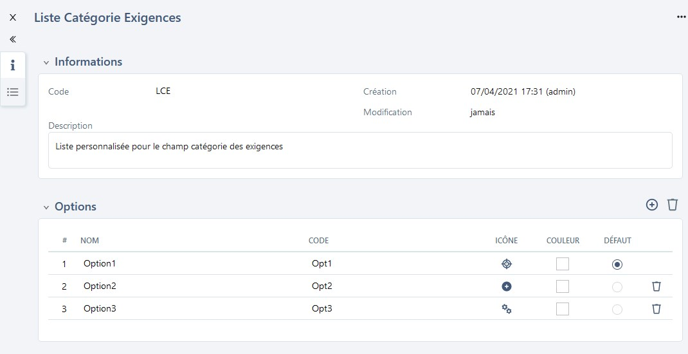

# Importer des exigences

Squash permet d’importer une arborescence d'exigences depuis un fichier au format .xls. 

Pour réaliser cet import, il  faut renseigner un fichier Excel en respectant les recommandations faites dans [Renseigner un fichier d'import d'exigences](#renseigner-un-fichier-dimport-dexigence) puis l'importer via l'option **[Importer]** de l'espace Exigences. Il est possible de simuler l'import pour vérifier la cohérence du fichier d'import avant de l'importer.

!!! tip "En savoir plus"
	Pour plus de détails sur la procédure à suivre pour réaliser un import, consulter la page [Importer/Exporter un objet](../presentation-generale/fonctionnalites-bibliotheque.md#importerexporter-un-objet).

## Renseigner un fichier d’import d’exigences

L'import d'exigences via un fichier Excel permet de créer ou modifier un patrimoine d'exigences **en masse**. Il est possible d'importer des exigences, leurs attributs ainsi que leurs associations (exigences et cas de test).
Cette fonctionnalité est très utile :

- lors d'une **migration** depuis un outil tiers
- pour récupérer un patrimoine de spécifications existant dans un document
- pour effectuer des modifications en masse sur les exigences présentes dans Squash

Squash permet d'importer une arborescence d'exigences depuis un fichier au format **.xls**, **.xlsx** ou **.xlsm**.

!!! info "Info"
	L'import est réservé aux profils "Administrateur" et "Chef de projet".
	 Un gabarit d'import est téléchargeable depuis la popup d'import dans l'espace Exigences.

### Structure du fichier d'import

Le fichier d'import comprend trois onglets : REQUIREMENT, LINK_REQ_TC et LINK_REQ_REQ  

 - L'onglet REQUIREMENT permet de remplir les informations liées aux exigences à importer comme l'emplacement, la description, la criticité, etc.  
 - L'onglet LINK_REQ_TC renseigne les informations pour associer les exigences à des cas de test déjà présents dans Squash.  
 - L’onglet LINK_REQ_REQ renseigne les informations pour lier des versions d’exigences entre elles (soit déjà présentes dans Squash, soit présentes dans le fichier d'import)

!!! warning "Focus"
	Le fichier d'import doit respecter les règles ci- dessous :
	
	- Le nom des 3 onglets ne doivent pas être modifiés.
	- Les entêtes des colonnes ne doivent pas être modifiées.  
	- Les lignes vides ne sont pas interprétées.   
	- Les cellules ne doivent pas être fusionnées.
	- L'ordre des lignes n'a pas d'importance. 
	- L'import se fait ligne par ligne.

### Onglet REQUIREMENT

| Nom de la colonne | Description | Valeur attendue |
|-----|------------|------|
| ACTION | Valeur qui indique l'action que l'on souhaite effectuer.| <u>Champ Obligatoire</u>  C : pour la création (**Create**)   U : pour la mise à jour (**Update**) |
| *PROJECT_ID*  | *ID du projet de destination* | _Colonne ignorée si présente dans le fichier d’import_|   
| *PROJECT_NAME* | *Nom du projet de destination* | _Colonne ignorée si présente dans le fichier d’import_|
| REQ_PATH | Chemin de l’exigence. Il commence par « /nom du projet » et se termine par le nom de l’exigence (= nom de la version courante, soit la dernière version). Il inclut le nom du projet car l’import est multi-projet. | <u>Champ Obligatoire</u>  Par exemple :  - /projet/dossier/exigence  - /projet/exiMère/exiFille|
| REQ_VERSION_NUM  | Numéro de version de l’exigence.  Mode **CREATE** : Si le champ n’est pas renseigné, deux cas possibles :  - Il n’y a qu’une version d’exigence avec ce REQ_PATH, alors REQ_VERSION_NUM=1.  - Il y a plusieurs versions d’exigences avec le même REQ_PATH, alors les versions sont numérotées dans l’ordre d’apparition à partir de 1.  Mode **UPDATE** : ce champ permet d’identifier la version à mettre à jour. | Mode **CREATE** : <u>Champ facultatif</u>.  Mode **UPDATE** : <u>Champ obligatoire</u>|
| REQ_VERSION_REFERENCE          | Référence de la version de l’exigence | |
| REQ_VERSION_NAME               | Nom de la version d’exigence.  - Mode **CREATE** : Ce champ est facultatif car indiqué à la fin du chemin dans la colonne REQ_PATH.  - Mode **UPDATE** : permet de renommer une exigence ||
| REQ_VERSION_CRITICALITY        | Code de la criticité de l’exigence |  - CRITICAL (Critique)  - MAJOR (Majeure)  - MINOR (Mineure)  - UNDEFINED (Non définie) [Valeur par défaut] |
| REQ_VERSION_CATEGORY | Code de la catégorie de l’exigence.  La liste peut être celle par défaut ou être une liste personnalisée. A l’import, si la valeur n’est pas renseignée ou non reconnue, la valeur par défaut est affectée. | - CAT_FUNCTIONAL (Fonctionnelle)  - CAT_NON_FUNCTIONAL (Non fonctionnelle)  - CAT_USE_CASE (Cas d'utilisation) - CAT_BUSINESS (Métier)  - CAT_TEST_REQUIREMENT (Exigence de test)  -  CAT_UNDEFINED (Non définie) [Valeur par défaut]   - CAT_ERGONOMIC (Ergonomique)  - CAT_PERFORMANCE (Performance)  - CAT_TECHNICAL (Technique)  - CAT_USER_STORY (User story)  - CAT_SECURITY (Sécurité) |
| REQ_VERSION_STATUS             | Code du statut de l’exigence | - APPROVED (Approuvée)  - OBSOLETE (Obsolète)  - UNDER_REVIEW (À approuver)  - WORK_IN_PROGRESS (En cours de rédaction) [Valeur par défaut] |
| REQ_VERSION_DESCRIPTION | Description de l’exigence |  |
| *REQ_VERSION_#_TC*               | *Nombre de cas de test associés à l’exigence. | *Colonne ignorée si présente dans le fichier d’import* |
| *REQ_VERSION_#_ATTACHEMENT*      | *Nombre de pièces jointes liées à l’exigence* | *Colonne ignorée si présente dans le fichier d’import* |
| REQ_VERSION_CREATED_ON         | Date de création de l’exigence.   La date doit être renseignée dans des cellules de type date ou de type texte au format ISO 8601. | Format : YYYY-MM-DD   Si elle n’est pas renseignée, la date de l'import est prise en compte. |
| REQ_VERSION__CREATED_BY        | Login du créateur. | Si non renseigné, c'est le login de l’utilisateur qui réalise l’import qui est utilisé.|
| *REQ_VERSION_LAST_MODIFIED_ON*   | *Date de dernière modification de l’exigence.* | *Colonne ignorée si présente dans le fichier d’import. C'est la date de l'import qui est prise en compte.* |
| *REQ_VERSION_LAST_MODIFIED_BY*   | *Login du dernier modificateur. | *Colonne ignorée si présente dans le fichier d’import. C'est le login de l'utilisateur ayant fait l'import qui est pris en compte.*  |
| REQ_VERSION_MILESTONE          | Intitulé du ou des Jalon(s) associé(s) à cette exigence.  Si un objet est associé à plusieurs jalons, chacun des jalons doit être renseigné dans la colonne correspondante séparé par un «\|».   Mode **UPDATE** : si la colonne est vide, les associations existantes sont supprimées |  Par exemple si une exigence est associée à deux jalons :  Jalon1 \| Jalon 2 |
| REQ_VERSION_CUF_<code du cuf\>  | Une colonne par champ personnalisé.  Dans l'en-tête, remplacer \<code du cuf\> par le code du champ personnalisé. | Valeur associée au champ personnalisé |

### Onglet LINK_REQ_TC

Si vous souhaitez faire des associations entre les exigences et des cas de test présents dans le référentiel, les 3 champs sont obligatoires.

| Nom de la colonne | Description | Valeur attendue |
|----|-------|-----|
| REQ_PATH          | Chemin de l'exigence depuis le nom du projet jusqu'au nom de l'exigence (version courante) NB : le nom de la version courante peut différer de celui de la version à lier |  Par exemple :  - /projet/dossier/exigence  - /projet/exiMère/exiFille     |
| REQ_VERSION_NUM   | Numéro de la version d'exigence à lier  |  |
| TC_PATH           | Chemin du cas de test depuis le nom du projet jusqu'au nom du cas de test  |  Par exemple : /projet/dossier/casdetest	|

### Onglet LINK_REQ_REQ

Si vous souhaitez faire des associations entre exigences, les 5 champs sont obligatoires.

| Nom de la colonne   | Description  | Valeur attendue | 
|--------|-----------|---|
| REQ_PATH    | Chemin de l'exigence depuis le nom du projet jusqu'au nom de l'exigence (version courante) NB : le nom de la version courante peut différer de celui de la version à lier | Par exemple :  - /projet/dossier/exigence  - /projet/exiMère/exiFille  |
| REQ_VERSION_NUM  | Numéro de la version d'exigence  |   |
| RELATED_REQ_PATH   | Chemin de l'exigence liée depuis le nom du projet jusqu'au nom de l'exigence (version courante)  NB : le nom de la version courante peut différer de celui de la version à lier |  Par exemple : /projet/dossier/nom_exigence_version_courante     |
| RELATED_REQ_VERSION_NUM  | Numéro de la version de l’exigence liée |   |
| RELATED_REQ_ROLE   | La valeur du champ code rôle pour le lien entre les exigences |  Par exemple :  pour lier une Exigence A (PARENT) à une Exigence B (CHILD) avec le rôle Parent-Enfant, saisir le rôle de l'exigence B : CHILD|

## Importer des exigences

L'import permet de créer des exigences avec toutes les fonctionnalités disponibles de l'espace Exigences :

### Créer une arborescence d'exigences

L'arborescence est très importante car elle permet d'**organiser le référentiel d'exigences**. L'import offre la possibilité de créer une arborescence précise des éléments à importer et ce dans plusieurs projets à la fois : Exigences, Dossiers, [Exigences mères et filles](./creer-organiser-referentiel-exigences.md#hierarchie-dexigences), etc.

Si les dossiers sont inexistants dans Squash au moment de l'import, ceux-ci sont créés par l'import. 

**Par exemple :**

Pour le chemin /Projet1/Dossier1/ExigenceMère/ExigenceFille :

- Si l’exigence ExigenceMère est présente dans le référentiel, ExigenceFille est ajoutée sous l'exigence mère ExigenceMère. 
- Si l’exigence mère n’existe pas dans le référentiel mais est présente dans le fichier d’import AVANT l'exigence fille, ExigenceFille est ajoutée sous l'exigence mère ExigenceMère. 
- Si l’exigence mère n’existe pas dans le référentiel, n’est pas présente dans le fichier d’import ou présente après l'exigence fille, alors l’exigence ExigenceFille est ajoutée dans le dossier ExigenceMère, sous-dossier de Dossier1.

### Importer des versions d'exigences

Pour **créer** plusieurs versions d'une même exigence, il faut une ligne par version dans le fichier Excel. Le numéro de la version à créer est à renseigner dans la colonne "REQ_VERSION_NUM".

!!! warning "Focus"
	Pour créer la version 3 d'une exigence, une version 2 dans le fichier d'import ou dans le référentiel doit impérativement être présente

Pour **modifier** les attributs d'une version d'exigence, la colonne "REQ_VERSION_NUM" doit être renseignée avec le numéro de la version à modifier et la colonne "REQ_PATH" avec le chemin de la version courante de l'exigence.

### Importer des exigences avec une liste personnalisée
Si une liste personnalisée est configurée pour la catégorie des exigences sur le projet, dans le fichier d'import, **le code de l'option** souhaitée sera à renseigner dans la colonne "REQ_VERSION_CATEGORY".

**Par exemple :**

1. Avoir une liste personnalisée avec plusieurs options, dont une des options est "Option2" associée au code "Opt2".
 

 
3. Dans le fichier Excel, renseigner la valeur du code de l'option dans la colonne "REQ_VERSION_CATEGORY" : ici "Opt2"

4. Lorsque le fichier est importé, l'exigence est créée et le champ 'Catégorie' est renseigné par "Option2"

### Importer des exigences avec des champs personnalisés

Si des champs personnalisés (CUF) sont configurés pour les exigences du projet, dans le fichier d'import, la colonne "REQ_VERSION_CUF_<code du cuf\>" peut être renseignée, à raison d'une colonne par champ personnalisé. L'entête de la colonne doit comporter le code du champ personnalisé présent sur sa page de consultation.

Contenu de la colonne "REQ_VERSION_CUF_<code du cuf\>" :

| Type de champ personnalisé | Valeur attendue |
|--|--|
| Tag | Tag1\|Tag2 |
| Case à cocher| 'true' ou 'false' |
| Liste déroulante | Libellé de l'option |
| Numérique| Par exemple : '50', '12,8' |
| Date| 'AAAA-MM-JJ'  |
| Texte simple| Texte avec 255 caractères maximum sans mise en forme  |
| Texte riche| Pour importer de la mise en forme, le texte doit être en HTML  |

### Importer des exigences avec des associations à des cas de test

L'onglet "LINK_REQ_TC" du fichier d'import est à compléter avec le chemin de l'exigence, le numéro de la version ainsi que le chemin du cas de test à associer. Pour que l'association fonctionne, le cas de test doit au préalable exister dans le référentiel.

Les informations sont visibles après l'import dans l'ancre 'Cas de test vérifiant cette exigence'  de l'exigence.

### Importer des exigences avec des associations à des exigences

L'onglet "LINK_REQ_REQ" du fichier d'import est à compléter avec les chemins des deux exigences à lier ainsi que leur numéro de version. Le code du type de lien sera également à renseigner. Pour que l'association fonctionne, l'exigence à lier doit au préalable exister dans le référentiel ou être présente dans le fichier d'import.

Les informations sont visibles après l'import dans l'ancre 'Exigences liées' de l'exigence.