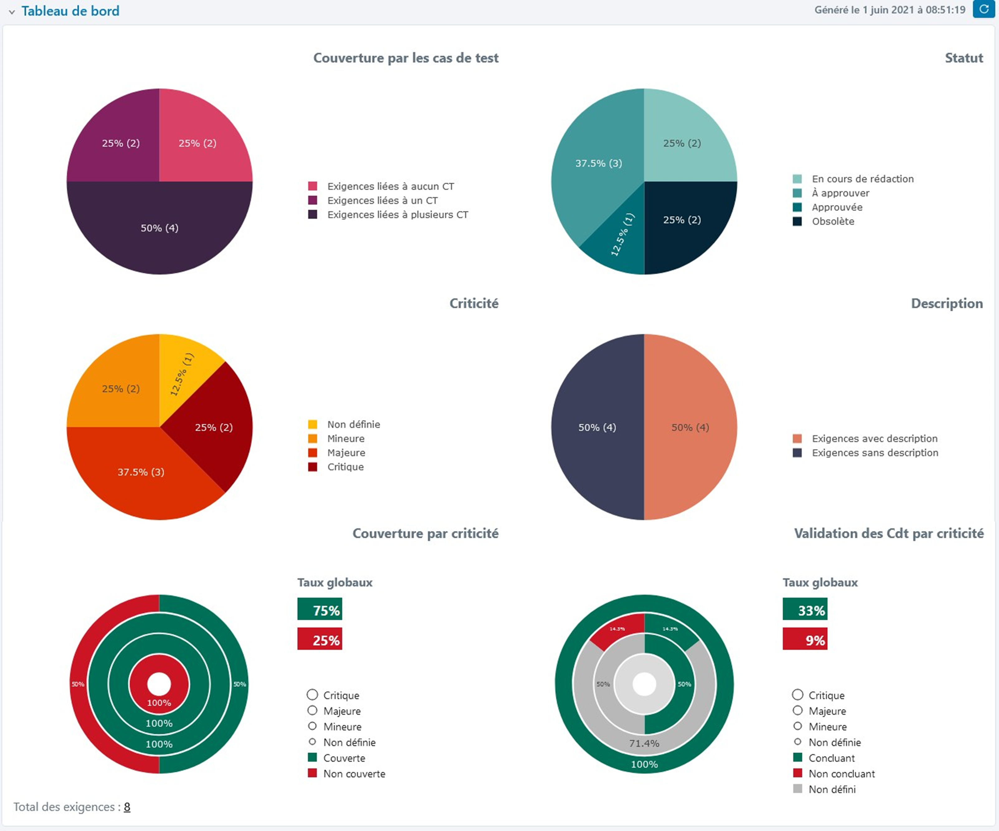

# Tableau de bord des exigences

En sélectionnant des éléments dans la bibliothèque des exigences, un tableau de bord s'affiche sur la page de consultation. Il est possible d’afficher un tableau de bord par défaut ou un tableau de bord personnalisé à l'aide du bouton **[Favori]**/**[Défaut]**.

!!! info "Info"
    Le tableau de bord s'affiche automatiquement lors de la sélection d'un projet ou d'un dossier. 
    Lors d'une sélection multiple (projets, dossiers, exigences), il est nécessaire de rafraîchir le tableau de bord pour l'afficher.

!!! tip "En savoir plus"
    Pour plus de renseignements sur le tableau de bord personnalisé, consulter la page "[Les tableaux de bord personnalisés](../pilotage-recette/tableaux-bord-perso.md)"

## Les différents graphiques

Le tableau de bord par défaut des exigences est composé de 6 graphiques :

- **Graphique 'Couverture par les cas de test'**

Répartition des exigences en fonction de leur association à aucun, un ou plusieurs cas de test. Ce graphique est très utile pour vérifier la couverture fonctionnelle de l'application et permet d'identifier les exigences non couvertes par des cas de test. 

- **Graphique 'Statut'**

Répartition des exigences en fonction de leur statut de rédaction. Ce graphique permet d'avoir une vue d'ensemble de l'avancement de la rédaction des exigences.

- **Graphique 'Criticité'** 

Répartition des exigences en fonction de leur criticité. 

- **Graphique 'Description'** 

Répartition des exigences en fonction de la présence ou non d'une description. Ce graphique permet d'identifier rapidement les exigences qui n'ont pas de description afin de la compléter. Pour rappel, la description d'une exigence correspond à une spécificité de l'application, et est primordiale pour la rédaction des tests.

- **Graphique 'Couverture par criticité'**

Répartition des exigences en fonction de leur criticité et de leur couverture par des cas de test. Ce graphique permet de prioriser la rédaction des cas de test qui doivent vérifer les exigences les plus critiques.

- **Graphique 'Validation des cas de test par criticité'**

Répartition des exigences en fonction de leur criticité et du taux de validation des cas de test associés aux exigences. Ce graphique permet par exemple, de savoir si toutes les exigences critiques ont été validées suite à l'exécution des cas de test associés.

## Accès à la page de recherche

Au clic sur les portions d'un graphique du tableau de bord par défaut, une page de recherche s'affiche, avec les critères présélectionnés correspondant à la portion de graphique.

**Par exemple :**
 
  Au clic sur la portion de graphique "Exigences liées à aucun CT" du graphique "Couverture par les cas de test", une page de recherche s'affiche avec le critère "Nombre de cas de test : Egal 0". 
  En cliquant sur le bouton  ou le bouton  il est possible de modifier directement le cas de test, et d'associer au moins un cas de test pour chaque exigence.

!!! info "Info"
    Cette fonctionnalité n'est pas disponible pour les tableaux de bord personnalisés
