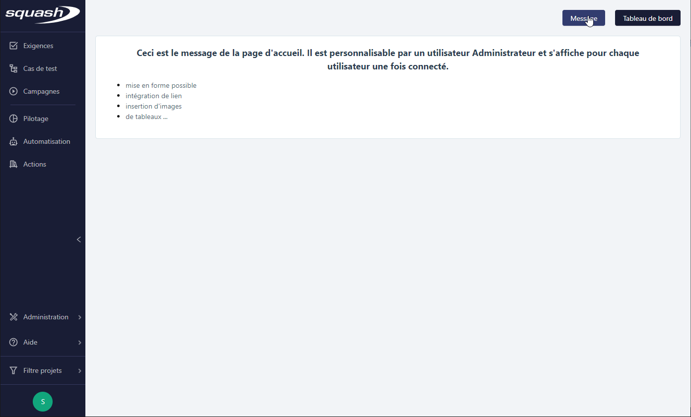
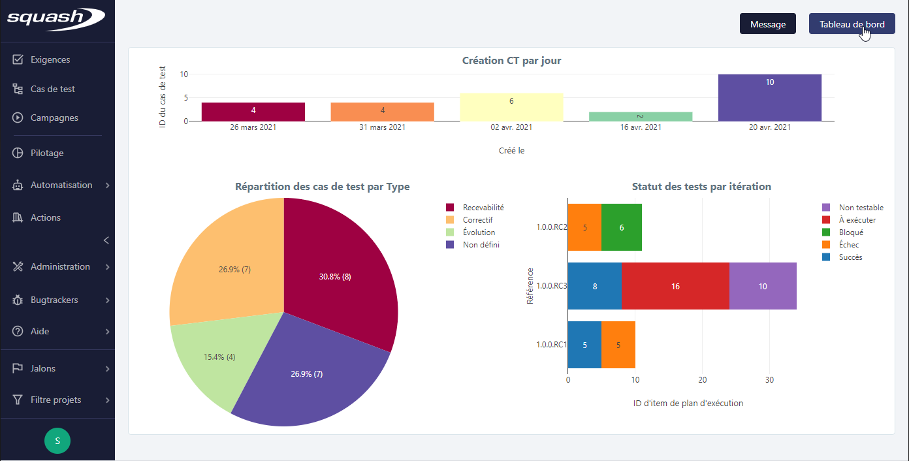
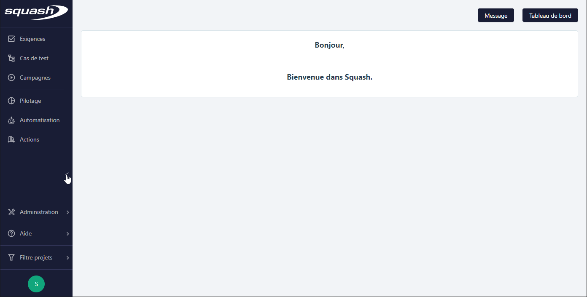
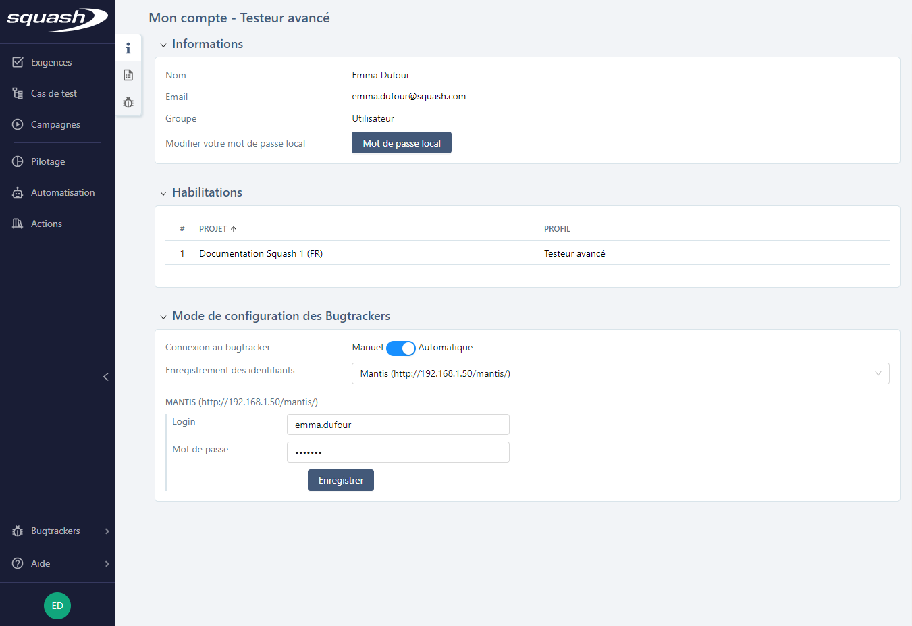
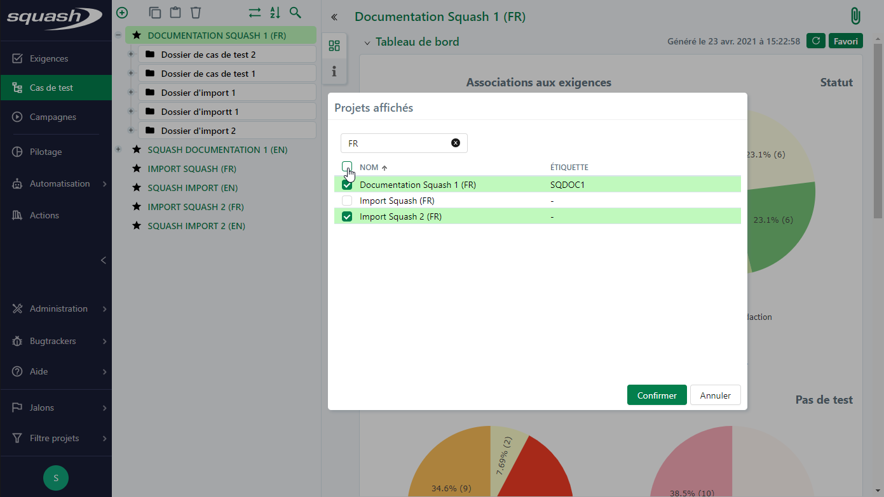

# Les différents espaces de Squash TM

## La page d’accueil de Squash TM

Une fois l'utilisateur connecté, il accède à la page d'accueil de l'application, où il peut choisir le contenu affiché :

Le clic sur le bouton **[Message]** affiche le Message de la page d'accueil (paramétrable par un Administrateur).

{class="pleinepage"}

Le clic sur le bouton **[Tableau de bord]** affiche le tableau de bord s'il a été désigné Favori pour la page d'accueil depuis l'espace Pilotage.

{class="pleinepage"}

La page d'accueil est également accessible depuis la barre de navigation en cliquant sur le logo Squash TM.

## Présentation des espaces de Squash TM

### La barre de navigation

La barre de navigation latérale, sur la gauche de l'écran, est permanente et permet d'accéder à tous moments aux différents espaces de Squash TM.

{class="pleinepage"}

Rétractée, elle n'affiche que les icônes des espaces afin d'offrir plus d'espace à la consultation des objets.

{class="pleinepage"}

### Espaces Exigences, Cas de test et Campagnes

Espaces dédiés au cœur de métier de qualification logicielle, ils permettent respectivement de :

- créer, organiser, tracer et versionner les exigences
- créer, gérer, modulariser et variabiliser les cas de test
- gérer, planifier et exécuter les campagnes de tests

### Espace Pilotage

Espace consacré au suivi de la recette, il est essentiellement destiné à l'usage des chefs de projet recette.

### Espace Automatisation

Espace destiné à la gestion du processus d'automatisation dans Squash TM.

### Espace Actions

Espace dédié à la mutualisation des actions des cas de test BDD (nécessite le plugin Bibliothèque d'actions).

!!! info "Info"
    Le menu Administration est accessible uniquement aux utilisateurs Administrateur ou Chef de projet

## Mon compte

La page **Mon compte** est accessible depuis l'icône contenant les initiales de l'utilisateur au pied de la barre de navigation.

Au survol de cette icône deux sous-menus s'affichent  : 'Mon compte' et 'Déconnexion'.

### Mon compte

La page 'Mon compte' ressence les informations du compte utilisateur courant à travers différents blocs :

**Informations**

Ce bloc contient les informations relatives à l'utilisateur courant : son nom, son mail et le groupe auquel il est associé (Administrateur ou Utilisateur). Il peut depuis cette page modifier son mail ou son mot de passe local. 
 
**Habilitations**

Cette table permet de visualiser la liste des projets auxquels l'utilisateur est associé et les permissions qui lui sont attribuées.

**Mode de configuration des bugtrackers**

Ce bloc permet de gérer la connexion aux bugtrackers associés aux projets sur lesquels l'utilisateur est habilité. 
Lorsque l'option 'Les utilisateurs s'authentifient eux-mêmes' est sélectionnée lors de la configuration d'un bugtracker par un administrateur et que celui-ci est associé à un projet auquel l'utilisateur a été habilité, alors l'utilisateur peut choisir une connexion manuelle ou automatique.

Lorsque la connexion 'Manuelle' au bugtracker est sélectionnée, l'utilisateur doit se connecter systématiquement au bugtracker pour déclarer ou consulter une anomalie en cliquant sur le bouton **[Se connecter].**
Lorsque la connexion ‘Automatique’ est sélectionnée, une connexion au bugtracker est automatiquement déclenchée.

Le champ 'Enregistrement des identifiants' liste les bugtrackers associés aux projets auxquels l'utilisateur est habilité. Lorsque l’utilisateur enregistre ses identifiants de connexion, il est connecté automatiquement au bugtracker depuis les différents espaces de l’application. Il est nécessaire de cliquer sur le bouton **[Enregistrer]** pour valider la saisie.

{class="pleinepage"}

### Déconnexion

Au clic sur le sous-menu 'Déconnexion', l'utilisateur courant est déconnecté de l'application.

## Filtre projets

Accessible depuis la barre de navigation, le menu **Filtre projets** permet de sélectionner les projets à afficher dans les bibliothèques des différents espaces de l'application et au niveau des fonctionnalités appelant le référentiel d'une bibliothèque.

Depuis ce menu, l'option "Tous les projets" permet d'afficher tous les projets tandis que l'option "Multi-projets" ouvre une fenêtre de sélection des projets. Pour sélectionner un projet à inclure dans le filtre, cocher la case devant son nom puis cliquer sur **[Confirmer]**. Pour faciliter la sélection des projets, un champ de recherche dynamique sur le Nom et l'Étiquette des projets est disponible. 

{class="pleinepage"}

!!! warning "Focus"
	Le filtre projets est appliqué par défaut sur les pages de Recherche.

## Bugtrackers

Le menu **Bugtrackers** de la barre de navigation affiche la liste de tous les bugtrackers associés aux projets sur lesquels l'utilisateur courant est habilité.

Au clic sur son nom, le bugtracker s'affiche dans un nouvel onglet ou dans une i-frame. Seuls les bugtrackers Jira et RTC supportent l'affichage en i-frame.

## Aide

Le menu **Aide** présent dans la barre de navigation donne accès à 3 sous-menus : 

### À propos de Squash

La popup indique la version de Squash TM en cours d'utilisation, le lien vers la licence LGPL et un lien vers les crédits des icônes utilisées dans l'application.

### Documentation

Le lien redirige vers la documentation en ligne de Squash TM.

### Rapporter une anomalie

Le lien redirige vers le Mantis de l'outil Squash TM sur lequel il est possible de soumettre les anomalies rencontrées au cours de son utilisation. La création d'un compte est libre sur cette instance.
