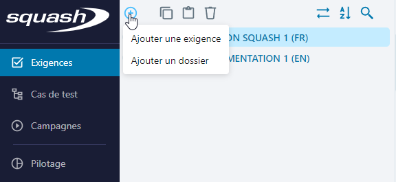
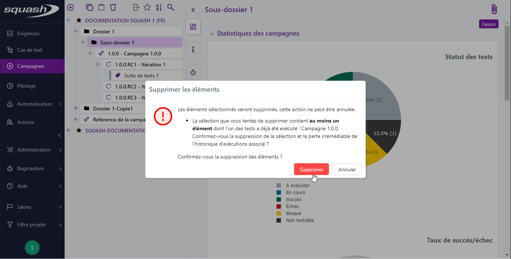
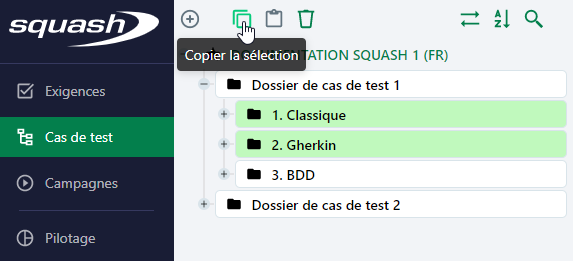
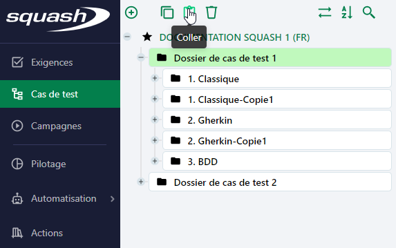
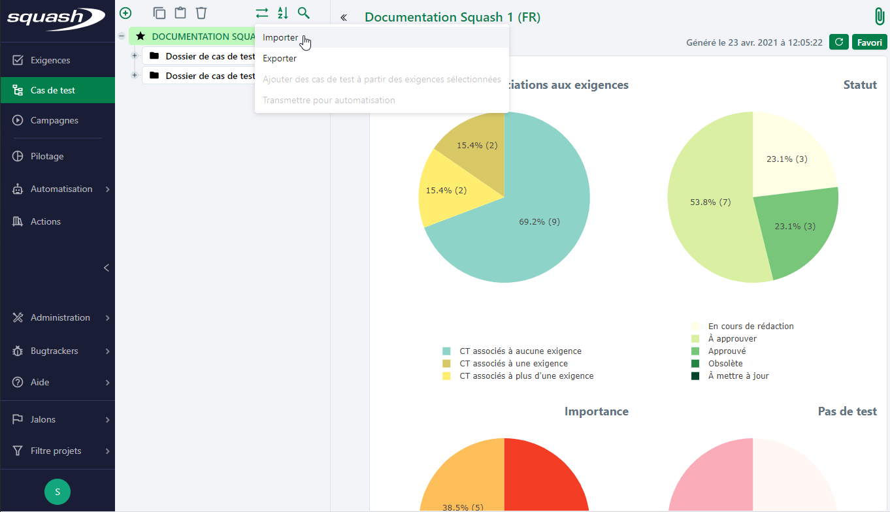
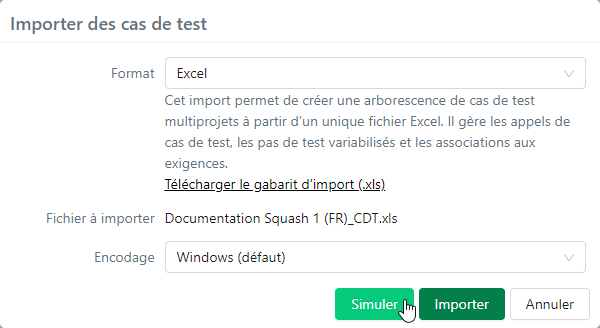

# Fonctionnalités de la bibliothèque inter projets

Au sein de chaque espace, Squash TM permet de réaliser des actions génériques depuis la bibliothèque inter projets. 

## Créer un objet

Lorsqu'une sélection est active dans la bibliothèque d'un espace (projet, dossier ou objet), au survol du bouton **[Ajouter]**  une liste des objets pouvant être ajoutés s'affiche. Il est possible d'ajouter un dossier (fonction communne à tous les espaces) ou des objets spécifiques à l'espace consulté. Selon l'élément cible sélectionné, certains items de la liste peuvent être grisés.

Le clic sur une option de la liste ouvre une popup de création. Il sera nécessaire de saisir, à minima, une valeur pour le champ 'Nom' pour pouvoir ajouter l'objet. Si des champs personnalisés obligatoires sont associés à l'objet, ils apparaissent également afin d'être renseignés à la création.

Cette popup de création offre la possibilité d'ajouter des objets à la chaîne. En effet, elle est réinitialisée au clic sur le bouton **[Ajouter un autre]** permettant ainsi l'ajout rapide de plusieurs objets.
À chaque ajout, la bibliothèque se met à jour automatiquement et l'objet est inséré à la racine de l'élément sélectionné.

Dans l'espace Pilotage, le clic sur certaines options de création donnent accès à une page de configuration :

- page de sélection des attributs pour 'Ajouter un graphique',
- page de sélection du rapport pour 'Ajouter un rapport',
- page de sélection des attributs pour 'Ajouter un export personnalisé'

Une fois les attributs ou le rapport sélectionnés, l'utilisateur peut enregistrer l'objet créé. Il est ensuite accessible depuis la bibliothèque de l'espace Pilotage à la racine de l'élément sélectionné.

## Supprimer un objet

Le bouton **[Supprimer]** est à la fois disponible dans la bibliothèque et dans certaines tables.

Suite à une sélection simple, multiple continue ou discontinue d'objets, le bouton **[Supprimer]** devient actif. Lorsque la sélection comporte un élément ne pouvant être supprimé, le bouton reste grisé (par exemple un projet ou une exigence dont le statut n'autorise pas sa suppression). Il est également possible de supprimer une sélection en utilisant le raccourci clavier **Suppr**.

Dans la bibliothèque, la suppression d'un objet ou répertoire parent entraîne la suppression de tous les éléments qu'il contient. Par exemple, la suppression d'un dossier de cas de test entraîne la suppression des cas de test qu'il contient et la suppression d'une campagne entraîne la suppression de ses itérations et des exécutions contenues dans celles-ci. 
 Cette régle ne s'applique pas à la suppression d'un exigence mère. En effet, si elle est supprimée, les exigences filles qu'elles contient s'affichent à l'emplacement précédent de l'exigence mère.

!!! danger "Attention"
	Toute suppression est définitive et il n'existe pas de moyen de récupérer ce qui a été supprimé. D'une manière générale nous recommandons d'être vigilant quant à l'attribution des profils et habilitations aux utilisateurs et de faire des sauvegardes régulières du patrimoine (exports d'objets et/ou sauvegarde de la base de données) afin de faciliter une restauration partielle ou complète.

## Copier/coller un objet

Lors d'une sélection simple, multiple continue ou discontinue d'objets, le bouton **[Copier la sélection]**  est actif. Lorsque la sélection comporte un élément ne pouvant être copié, le bouton reste grisé (un projet par exemple).
Il est également possible de copier une sélection en utilisant le raccourci clavier **Crtl+C**.

Lorsque des éléments ont été copiés, il faut sélectionner un répertoire de destination pour activer le bouton **[Coller]**  :

- la copie d'éléments peut se faire au sein d'un même projet ou dans un autre projet
- si les deux projets présentent la même configuration les attributs des éléments sont repris à l'identique
- si les deux projets présentent des configurations différentes, les valeurs par défaut des champs ou listes personnalisées du projet de destination seront attribués aux éléments collés
- les éléments copiés sont gardés en mémoire et peuvent être collés à différents emplacements dans l'arborescence
- lorsque la sélection comporte un élément ne pouvant être copié dans l'élément cible, le bouton est grisé : un dossier ne peut pas être copié dans une exigence, un cas de test dans un autre cas de test ou une itération dans un projet

Il est également possible de coller une sélection en utilisant le raccourci clavier **Crtl+V**.

!!! warning "Focus"
	Lors du copier/coller d'un objet de l'espace Campagnes, les exécutions des tests présentes dans les plans d'exécution ne sont pas conservées.

## Déplacer un objet

Il est possible de déplacer une sélection d'objets au sein d'un même projet ou vers un autre projet. Pour cela :
 
 1. Effectuer une sélection simple ou multiple, continue ou discontinue via les touches **[Maj]+clic** ou **[Ctrl]+clic**
 2. Glisser/déposer la sélection vers l'emplacement de destination. Il est marqué par un indicateur visuel.

Lors d'un déplacement d'objet d'un projet à un autre : 

 - si les deux projets présentent des configurations différentes, les valeurs de tous les champs sont conservés à l'identique sauf pour les champs personnalisés, listes personnalisées et jalons
 - si les deux projets présentent la même configuration, les champs personnalisés, listes personnalisées et les jalons sont repris à l'identique
 - toutes les associations de l'objet sont conservées : liens exigence/exigence, lien exigence/cas de test, appel de cas de test, etc
 - lorsque la sélection comporte un élément ne pouvant être déplacé, il est impossible de visualiser un emplacement de destination

 

 

!!! warning "Focus"
	Lorsque la bibliothèque est en ordre positionnel, la position cible du ou des éléments déplacés devient la position définitive.

## Ordonner la bibliothèque

Le bouton **[Ordonner la bibliothèque]**  permet à l'utilisateur de choisir l'ordre d'affichage des objets dans les bibliothèques des espaces Exigences, Cas de test et Campagnes.
Cet ordre, propre à chaque espace, est partagé par l’ensemble des utilisateurs.

L'ordre alphabétique affiche les objets par ordre alphabétique de leur référence (lorsqu'elle existe), puis de leur nom.

L'ordre positionnel permet à l'utilisateur de définir l'ordre dans lequel les objets sont affichés. Pour cela, il peut ordonner les différents objets les uns par rapport aux autres dans la bibliothèque par glisser-déposer.

 

## Importer/Exporter un objet 

Depuis les espaces Exigences, Cas de test et Campagnes, le bouton [Importer/Exporter]  affiche un sous-menu permettant d'accéder aux fonctionnalités d'import/export.

### Importer

La fonction d'import permet d'importer en masse une arborescence d'éléments dans les espaces Exigences ou Cas de test. Il est notamment possible d'importer depuis un même fichier des éléments dans différents projets Squash TM.

Pour importer une arborescence d'exigences ou de cas de test au format Excel :

1. Cliquer sur l'option 'Importer'
2. Dans la popup d'import, télécharger le gabarit d'import
3. Compléter le fichier d'import
4. Choisir le fichier d'import depuis la popup
5. Simuler l'import. Cette étape permet de vérifier que le fichier d'import est conforme. Elle est facultative.
6. Importer le fichier 
7. Une fois l'import effectué, l'arborescence est mise à jour.

À l'issue de la simulation et/ou de l'import, un rapport s'affiche et présente :

- les lignes traitées en succès : aucune erreur rencontrée, les objets sont importés tels qu'ils figurent dans le fichier
- les lignes traitées avec réserve : les objets sont importés mais des éléments peuvent manquer ou avoir été modifiés
- les lignes en échec : les objets ne sont pas importés pour cause de saisie incomplète ou erronée dans le fichier d'import
- un bilan téléchargeable qui détaille les erreurs rencontrées

Il est également possible d'importer les cas de test au format Zip :

- La même procédure que pour le format Excel s'applique
- Pour ce format, il est nécessaire de sélectionner un projet de destination

!!! tip "En savoir plus"
    Pour compléter un fichier d'import, consulter les pages [Renseigner un fichier d'import d'exigences](../gestion-exigences/importer-exigences.md#renseigner-un-fichier-dimport-dexigences) et [Renseigner un fichier d'import de cas de test](../gestion-cas-test/importer-cas-test.md#renseigner-un-fichier-dimport-de-cas-de-test)
    

!!! warning "Attention"
    L'import de campagnes, itérations ou suites n'est pas disponible.

### Exporter

La fonction d'export permet d'exporter en masse des éléments des espaces Exigences et Cas de test. Elle fonctionne sur une sélection simple, multiple continue ou discontinue d'éléments d'un ou plusieurs projets.

Pour exporter une arborescence d'exigences ou de cas de test au format Excel :

1. Sélectionner des éléments dans l'arborescence (projets, dossiers, ou objets)
2. Cliquer sur l'option 'Exporter'
3. Dans la popup, choisir le format d'export. Le format XLS est compatible au format attendu pour un import  tandis que le format CSV est idéal pour l'exploitation de données.
4. Nommer le fichier d'export
5. Choisir les options d'export. L'option 'Conserver le format des textes riches' permet de conserver les balises html des champs texte riches (ex: champ 'Description') afin de conserver leur mise en forme pour un futur import
6. Cliquer sur **[Exporter]** pour télécharger le document.

L'export dans l'espace Campagnes est différent. Il ne fonctionne que si une seule campagne est sélectionnée et il se décline sous trois formes :  simple, standard ou complet.

Pour exporter une campagne au format Excel :

1. Sélectionner une campagne
2. Survoler le bouton 
3. Choisir un des 3 formats d'export possibles.
4. Le fichier est téléchargé directement au format CSV sur le poste de l'utilisateur.

!!! tip "En savoir plus"
    Pour plus de détails sur les exports de campagnes, consulter la page [Exporter les données d'une campagne](../gestion-executions/exporter-campagne.md)

## Générer un tableau de bord 

Depuis la bibliothèque d'un espace, un tableau de bord par défaut s'affiche à la sélection d'un projet, d'un dossier ou d'une sélection multiple d'objets.
Les tableaux de bord par défaut présentent une sélection de graphiques indiquants l'état d'avancement de rédaction, de couverture et de validation des objets de chaque espace.

Au survol d'une portion, une infobulle précise le critère de la portion, le nombre d'éléments comptabilisé pour ce critère et le pourcentage que cela représente par rapport au nombre total d'éléments de la sélection.

Le clic sur une portion renvoie vers le résultat de recherche relatif aux critères de la portion : le périmètre de la recherche correspond à la sélection réalisée et le ou les critères propres au graphique et à la portion choisie sont pré-sélectionnés.

Il est alors possible d'affiner sa recherche et d'utiliser [toutes les fonctionnalités liées à la recherche](./fonctionnalites-objet.md#rechercher-un-objet).