# Fonctionnalités des objets

[TOC]

## Modifier les champs d’un objet

Chaque objet de Squash est constitué de divers attributs représentés sous forme de champs de différents types. Au survol de la valeur du champ, un indicateur visuel signale à l'utilisateur qu'elle est modifiable (valeur soulignée, icône crayon ou cadre de couleur).

Pour modifier un attribut, il suffit de cliquer sur la valeur du champ, de renseigner une nouvelle valeur, puis de valider (bouton **[Confirmer]** ou touche **[Entrée]** du clavier).

Les différents types de champs présents dans l'application sont les suivants :

- Texte simple : texte sans mise en forme, sur une seule ligne
- Case à cocher
- Date : permet de sélectionner une date dans un calendrier ou de la saisir au format jj/mm/aaaa
- Liste déroulante
- Numérique
- Tag : permet de saisir une ou plusieurs valeurs sous forme d'étiquettes avec de l'autocomplétion
- Texte riche : texte multilignes avec de la mise en forme

!!! tip "En savoir plus"
	Pour plus de détails sur les champs texte riche, consulter la partie [Les champs texte riche](#les-champs-texte-riche)

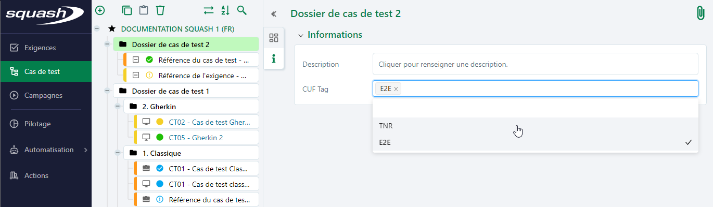

## Les champs texte riche

Les champs textes riches peuvent accueillir du texte sur plusieurs lignes et offrent la possibilité de mettre en forme ce texte, d'insérer des tableaux, des images ou des liens.

La mise en forme de ces champs est conservée dans les exports. Néanmoins, pour que ces fichiers soient générés correctement, il est nécessaire de respecter les règles suivantes pour insérer des éléments dans les champs texte riche. 

### Insérer un tableau

Pour insérer un tableau dans un champ texte riche :

 1. Cliquer sur l'icône  présente dans la barre d'icônes du champ texte riche
 2. Renseigner les propriétés du tableau : nombre de lignes, nombre de colonnes, propriétés avancées
 3. Cliquer sur **[Ok]**

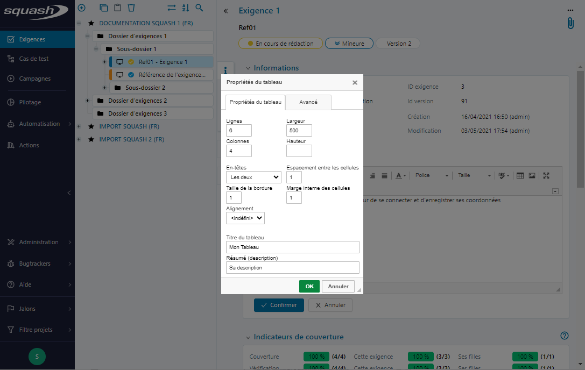
  

Le tableau est inséré et prêt à être renseigné.

### Insérer un lien

Pour insérer un lien dans un champ texte riche :

 1. Sélectionner la chaîne de caractère sur laquelle le lien devra être inséré
 2. Cliquer sur le bouton 
 3. Renseigner le lien et ses propriétés : type, mode d'ouverture, infobulle
 4. Cliquer sur **[OK]**

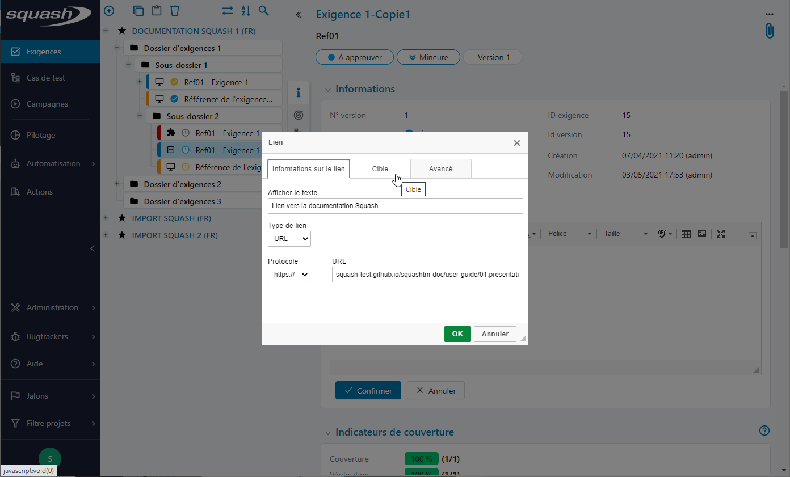
  
 
Il est désormais possible d’accéder au lien via un simple clic sur ce dernier.

### Insérer une image

Pour insérer une image dans un champ texte riche : 

 1. À partir du mode édition du champ texte riche,  cliquer sur l'icône 
 2. Renseigner url de l'image et ses propriétés : saisir un texte alternatif, redimensionner l'image, insérer une infobulle au survol de l'image
  
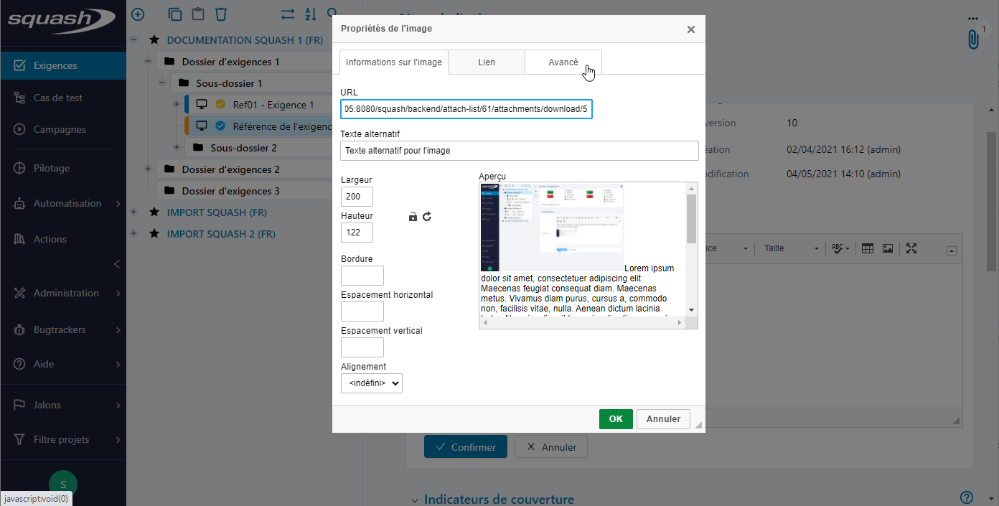
  
 3. Cliquer sur **[OK]**

L'image s'affiche dans le champ texte riche avec les propriétés définies précédemment.

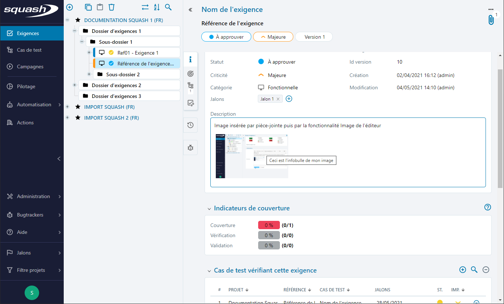

!!! note "Info"
	Pour ajouter une image stockée localement, réaliser au préalable les étapes suivantes avant de procéder à l'insertion de l'image dans le champ texte : 

	 1. À partir de la page de consultation de l'élément, ajouter l'image en pièce jointe via la fonctionnalité accessible par l'icone 
	 2. Récupérer l'url par clic droit sur le nom de l'image puis copier l'adresse du lien

## Fonctionnement des tables

Les associations entre objets (Exigences-Exigences, Exigences-Cas de test, Plan d'exécution-Cas de test) sont formalisées dans des tables à partir desquelles il est possible, selon l'habilitation de l'utilisateur :

 - d'ajouter une association
 - de rechercher un ou plusieurs objets et associer la sélection
 - de supprimer une association 
 - de supprimer une sélection d'associations
 - d'accéder via un lien à la page de niveau 2 de l'élément dans la table

Par défaut, un tri est appliqué aux tables et il est possible, en cliquant sur l'en-tête de la colonne de modifier ce tri : la flèche orientée vers le haut indique un tri alphabétique ou chronologique, la flèche orientée vers le bas indique un tri alphabétique inverse ou anté-chronologique.

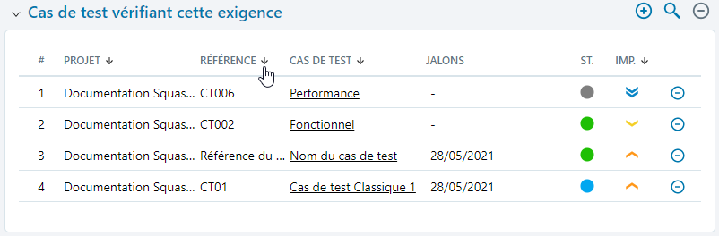

!!! note "Info"
	La table d'un plan d'exécution peut également être filtrée en saisissant du texte ou en sélectionnant une valeur après avoir cliqué sur l'icone de filtre. 

## Associer/dissocier des objets

Squash permet de lier des objets entre eux : deux exigences entre elles, une exigence à un cas de test ou un cas de test à un plan d'exécution.

### Associer depuis la bibliothèque
Depuis la page de consultation d'une exigence, il est possible, par glisser/déposer d'une exigence depuis la bibliothèque, de l'associer à l'exigence consultée. Elles apparaissent alors toutes deux, respectivement dans leur table **Exigences liées**.

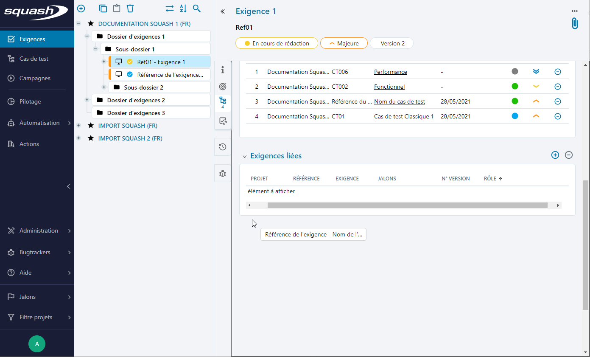

### Associer depuis la recherche
À partir d'une table d'association, **Cas de test vérifiant cette exigence**, **Exigences vérifiées par ce cas de test** ou un **Plan d'exécution**, le bouton  permet d'accéder à la recherche des objets: tout ou partie des résultats peut alors être associé.

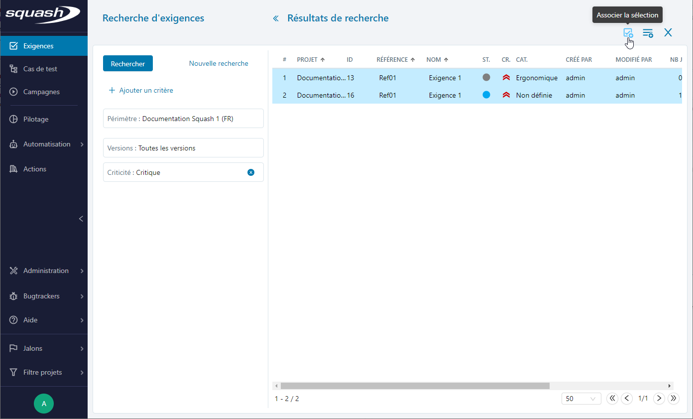

!!! note "Info"
	Depuis un **Plan d'exécution**, il est possible d'accéder à la recherche directe de cas de test ou d'accéder à la recherche d'exigences dont les résultats sont les cas de tests associés aux exigences respectant les critères de recherche.

### Dissocier des objets

Dans les différentes tables de Squash, il est possible de supprimer une association via le bouton présent en bout de ligne pour une dissociation simple ou via le bouton présent au dessus de la table lors d'une sélection multiple.

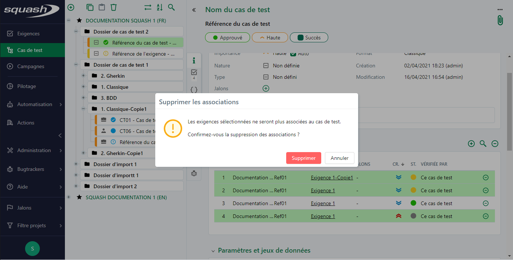

## Ajouter/Supprimer une pièce jointe

### Ajouter une pièce jointe
Sur la page de consultation d'un objet (dossier, exigences, cas de test, pas de test, campagne, itération ou suite), il est possible d'ajouter des pièces jointes via l'icone .
L'ajout se fait par glisser déposer dans l'encart dédié ou en parcourant les répertoires locaux.

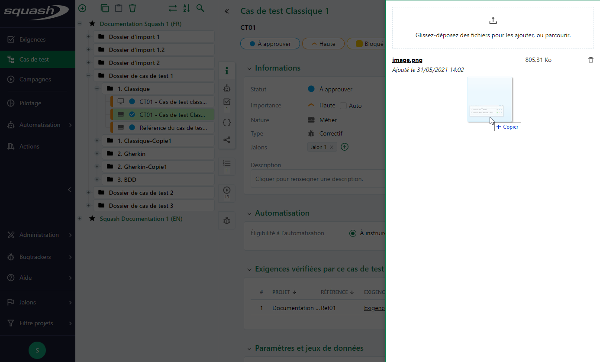

Ce volet permet de consulter les informations des pièces jointes (nom, taille et date d'ajout) et de les télécharger.

!!! note "Info"
	Par défaut, les types de fichier acceptés sont : txt, doc, xls, ppt, docx, xlsx, pptx, odt, ods, odp, pdf. La liste est modifiable par un Administrateur pour ajouter ou supprimer des extensions.
	Par défaut, la taille maximale d'une pièce jointe est de 4000000 bytes. Elle aussi peut être ajustée par un Administrateur.

### Supprimer une pièce jointe
À partir du volet des pièces jointes, la suppression des pièces jointes est possible via le bouton **[Poubelle]** présent en bout de ligne.

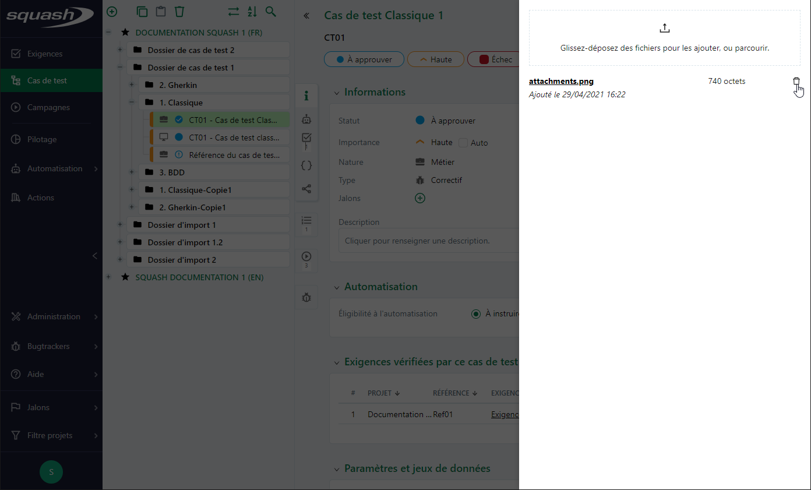

## Rechercher un objet

Au clic sur le bouton [Rechercher]  présent au-dessus des bibliothèques Exigences, Cas de test et Campagnes, la page de recherche propre à chaque espace s'ouvre. Par défaut, le périmètre de recherche est celui du filtre projet.
Le volet sur la gauche de la page des résultats de recherche permet de définir un périmètre de recherche et d'ajouter des critères de recherches propres aux objets de l'espace.

### Le périmètre
Depuis le critère Périmètre et l'onglet Projet, il est possible de sélectionner ou désélectionner par case à cocher le ou les projets à inclure ou exclure du périmètre.

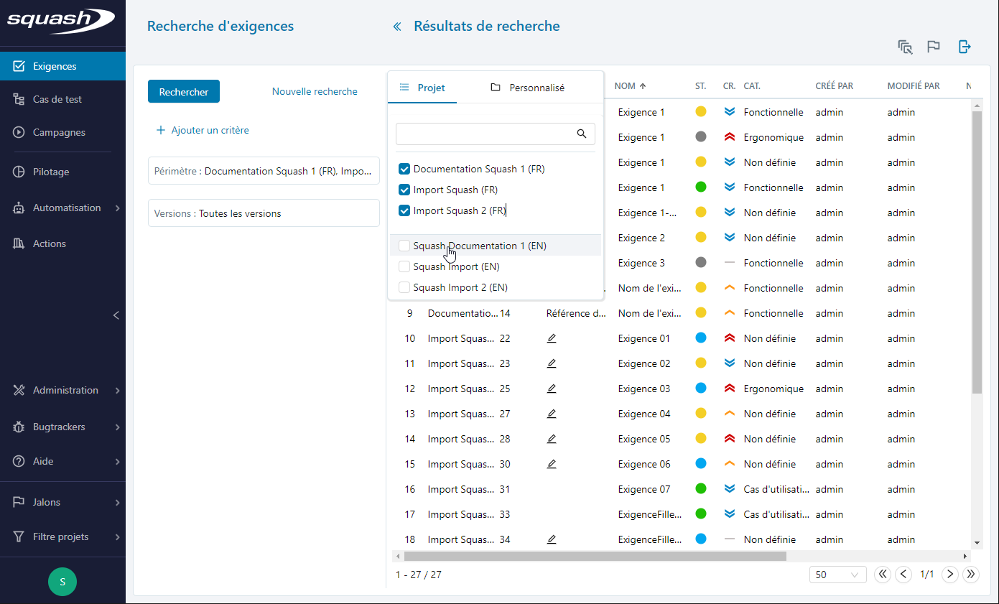

L'onglet Personnalisé permet de sélectionner un ou plusieurs répertoires ou des éléments pour définir le périmètre de recherche.

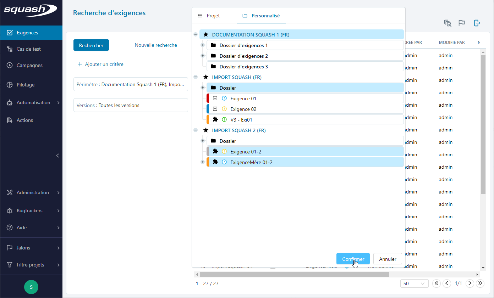

### Les critères
L'ajout de critères de recherche se fait par simple sélection des attributs disponibles pour l'entité de l'espace à partir du bouton **[Ajouter des critères]**. La liste de résultat se met automatiquement à jour à la sélection d'un critère.

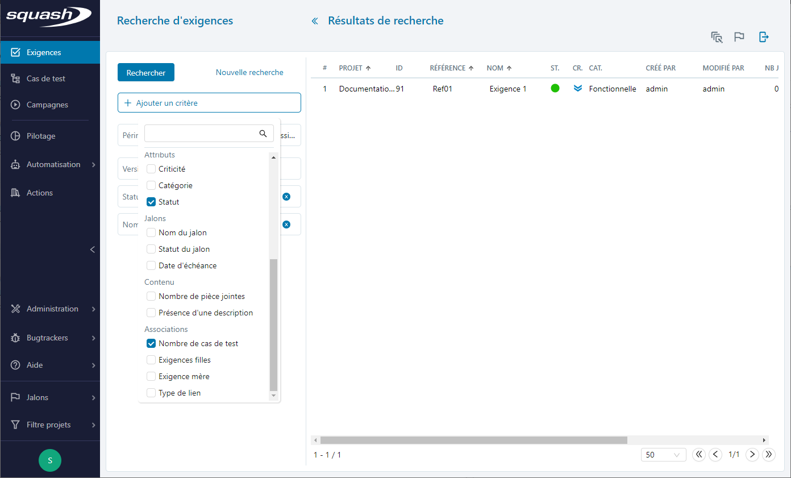 

Le clic sur le bouton **[Nouvelle recherche]** réinitialise les critères de recherche.

### Modifier les attributs
À partir d'une sélection simple ou multiple dans la table de résultats, il est possible de modifier en masse certains attributs :

 - le statut, la criticité ou la catégorie de la version d'une exigence
 - l'importance, le statut, le type, la nature ou l'éligibilité à l'automatisation d'un cas de test
 - le statut d'exécution d'un test associé à un plan d'itération
 
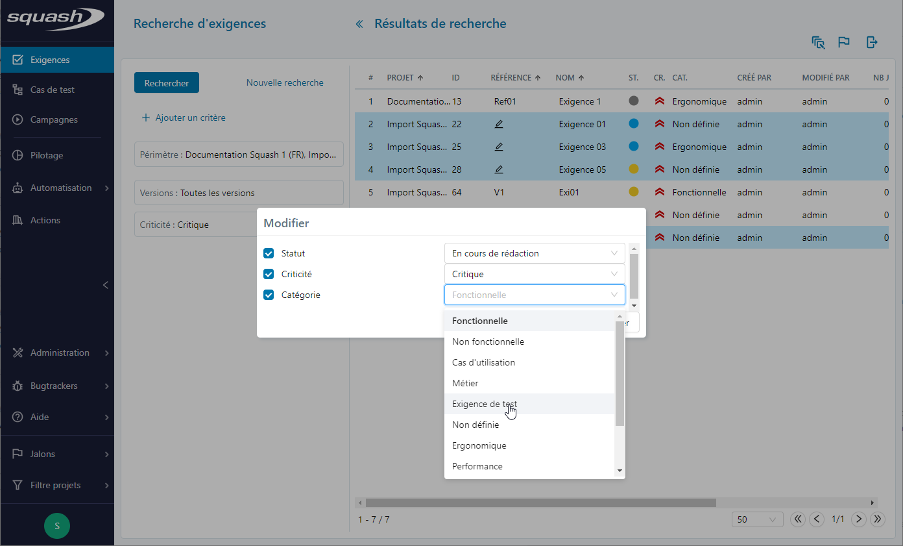 

!!! note "Info"
	Il est possible via cette fonctionnalité d'appliquer le statut Approuvée à une version d'exigence depuis n'importe quel autre statut.

### Modifier les associations aux jalons
À partir d'une sélection simple ou multiple dans la table de résultats, il est possible d'associer en masse la sélection à un jalon à condition que le jalon soit déjà associé au projet auxquels appartiennent les objets sélectionnés.

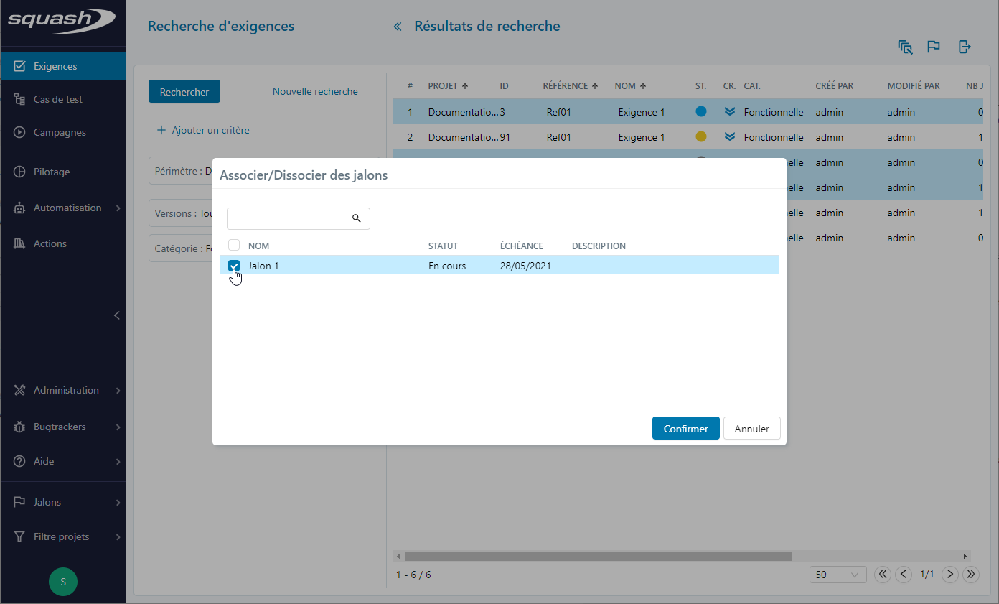

### Exporter
À partir du bouton **[Exporter]**, il est possible d'exporter vers un tableur tout ou sélection du résultat de recherche.
Diverses options sont alors disponibles : 

 - le format XLS 'Champs actuels' : cet export permet de récupérer les données des exigence ou des cas de test sous la forme d'un classeur Excel n'ayant que les informations affichées dans les résultats de recherche;
 - le format XLS 'Tous les champs' : cet export permet de récupérer l'intégralité des données des exigences des cas de test sous la forme d'un classeur Excel.
 - conserver le format des textes riches : les champs de type "texte riche" seront exportés avec leur balises HTML afin de conserver la mise en forme lors d'un futur import. Ne pas conserver le format facilite la lecture de ces champs dans l'export
 - inclure ou non les cas de test appelés (pour l'espace Cas de test uniquement)

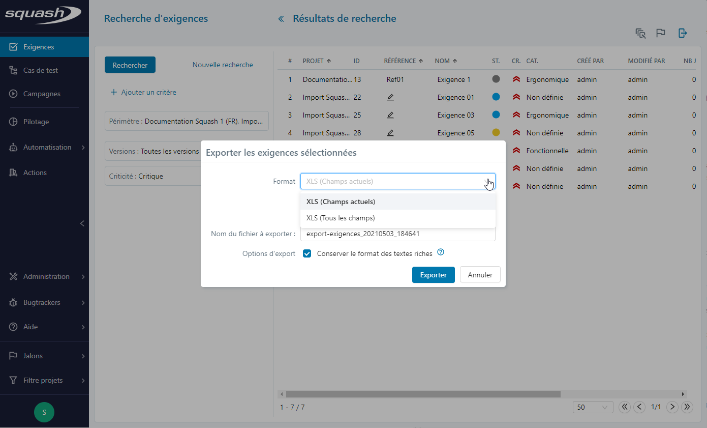

!!! tip "En savoir plus"
	Les résultats de recherche de l'espace Campagne ne sont pas exportables mais il est possible d'[ajouter tout ou sélection des résultats à un plan d'exécution d'une itération](../gestion-executions/creer-plan-execution.md#identifier-les-tests-a-rejouer-selon-les-resultats-dexecution-precedents).

