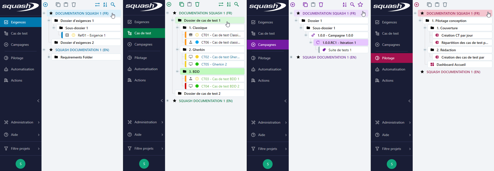
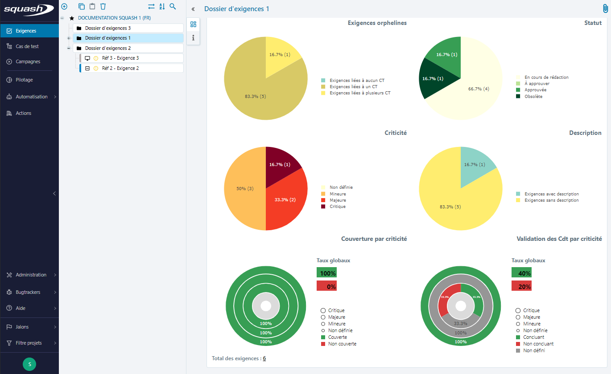
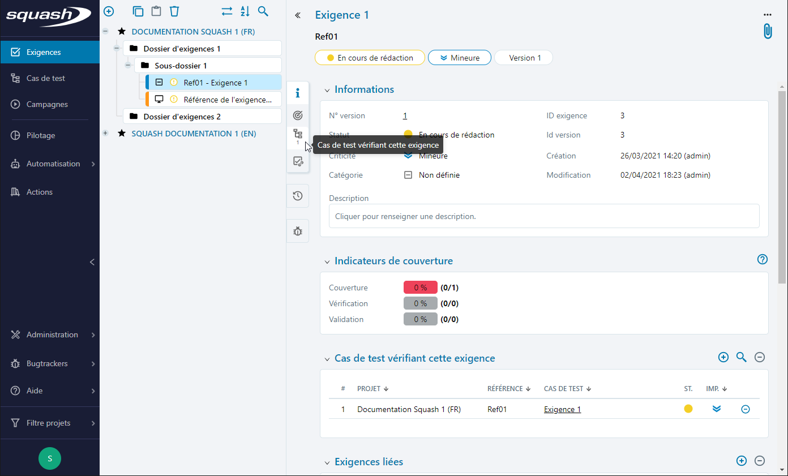

# Structure générique des pages Squash

## La bibliothèque

Pour l'ensemble de l'application, la bibliothèque de chaque espace est structurée à l'identique.
L'arbre présente les projets dans la couleur de l'espace. En cliquant sur le bouton **[+]** devant  un élément ou en double cliquant sur celui-ci, l'utilisateur déroule l'arborescence.
Il est ainsi possible d'organiser sa bibliothèque en arborescence de dossiers et sous-dossiers qui contiennent eux-mêmes les objets rattachés au projet.

Devant le nom de chaque projet dans la bibliothèque, une icône indique les permissions de l'utilisateur courant :

-  : cette icône indique que l'utilisateur dispose des droits de création/suppression, de modification et de lecture pour l'espace.
-  : cette icône indique un droit de modification et de lecture mais pas de création ou de suppression.
-  : cette icône indique un droit de lecture uniquement sur l'espace.
-  : cette icône, visible uniquement sur l'espace Campagnes, indique un droit d'exécution sur les tests présents dans les plans d'exécution du projet.

!!! warning "Focus"
	Le profil Automaticien n'a pas accès aux espaces classiques de Squash. Il n'a des droits que sur l'espace Automatisation.

## La page de consultation 

Dans chaque espaces, le clic sur un objet présent dans la bibliothèque ouvre sa page de consultation. Le schéma de fonctionnement est identique sur tous les espaces.

### Partie haute de la page

La page de consultation est constituée d'une partie haute fixe qui comporte le nom et la référence de l'objet consulté et qui permet de gérer ses pièces jointes.
Pour certains objets, cette partie affiche également des capsules reprenant les attributs principaux de l'objet sélectionné.

### Ancres et blocs

Au sein de la page de consultation, les informations de l'objet sélectionné sont affichées dans différents bloc escamotables, accessibles via des ancres.
Les ancres d'un objet sont rangées par groupe fonctionnel. Elles permettent de naviguer soit vers un bloc présent dans la page, soit vers un bloc présent sur une autre page.
Au survol d'une ancre, son infobulle affiche le titre du bloc associé. 
Un indicateur chiffré sur l'ancre indique à l'utilisateur le nombre d'éléments présents dans la table correspondante (nombre de Cas de tests vérifiant cette exigence, nombre d'Exécutions d'un cas de test, nombre d'Anomalies connues...)
Lors de la sélection d'un autre objet du même type dans la bibliothèque, le bloc correspondant à la dernière ancre sélectionnée s'affiche, facilitant ainsi la consultation en masse d'une même information.

### Affichage étendu ou réduit

Par défaut, l'affichage est en mode réduit (bibliothèque visible + page de consultation). Il est possible de masquer la bibliothèque afin d'étendre l'affiche de la page de consultation en cliquant sur le bouton **[<<]** à gauche du nom de l'objet et de revenir à l'affiche réduit en cliquant sur le bouton **[>>]**.

